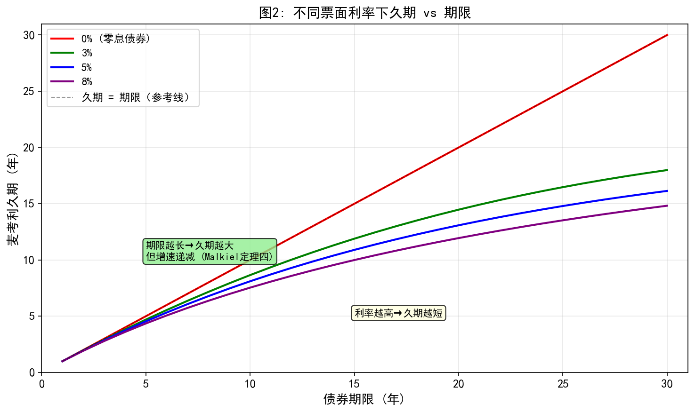
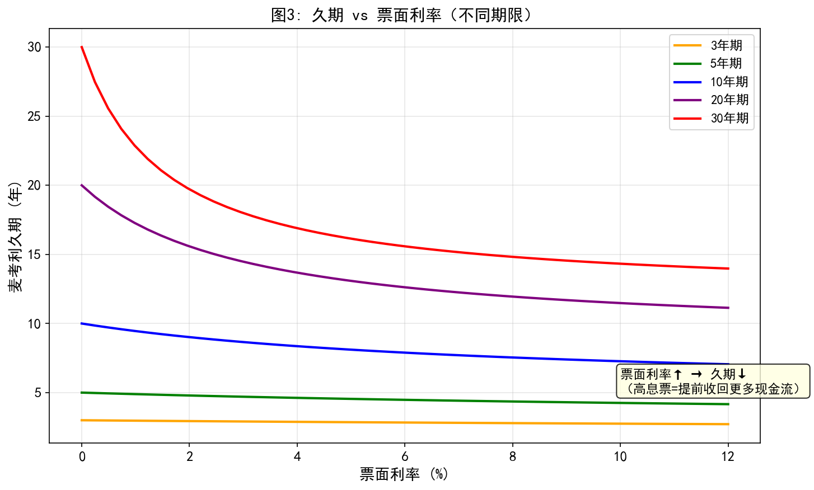
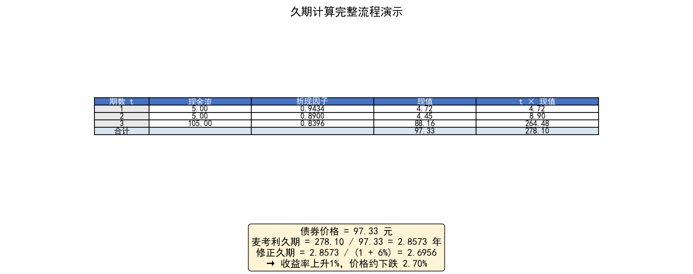
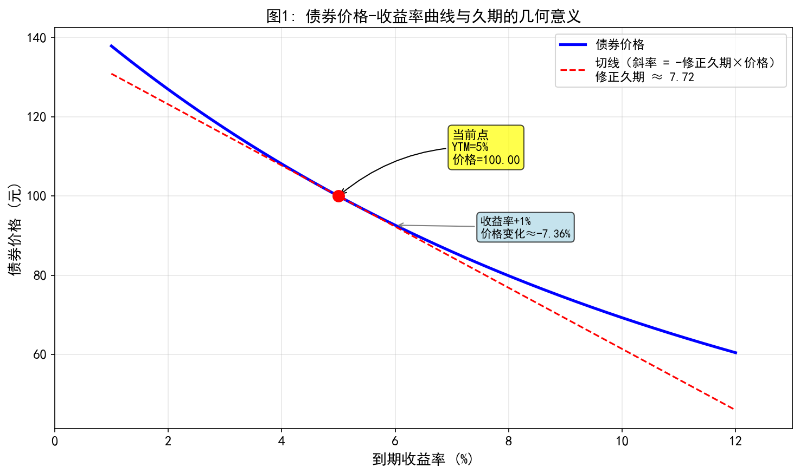
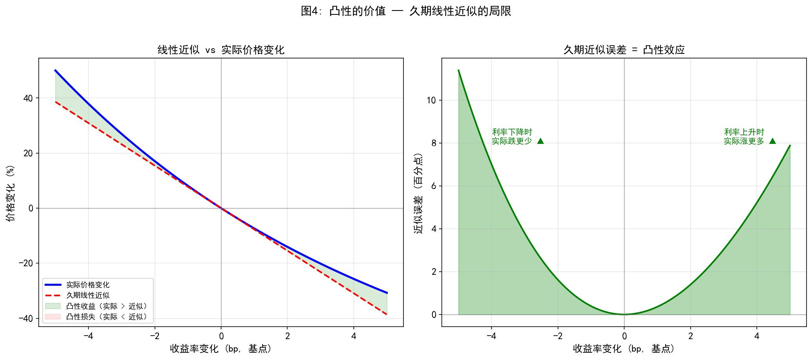

# 债券久期

## 目录

- [第一部分：久期是什么？](#第一部分久期是什么)
- [第二部分：麦考利久期 — 数学定义与手算](#第二部分麦考利久期--数学定义与手算)
- [第三部分：修正久期 — 从久期到利率敏感度](#第三部分修正久期--从久期到利率敏感度)
- [第四部分：久期的决定因素](#第四部分久期的决定因素)
- [第五部分：Python 实战 — 动手计算久期](#第五部分python-实战--动手计算久期)
- [第六部分：久期的实战应用](#第六部分久期的实战应用)
- [第七部分：久期的局限与凸性](#第七部分久期的局限与凸性)
- [总结](#总结)

---

## 第一部分：久期是什么？

### 从一个问题开始

假设有两张债券：
- **债券 A**：1 年后还本付息，共 105 元
- **债券 B**：每年付息 5 元，持续 10 年，第 10 年还本 100 元

**问题：哪张债券对利率变化更敏感？**

直觉告诉我们：债券 B。因为它的钱要等 10 年才能全部收回，这 10 年间利率的波动会反复影响那些未来现金流的价值。

**久期（Duration）** 就是量化这个直觉的工具。它不是"期限"（Maturity），而是一种"加权平均回款时间"。

### 一个生活中的类比

想象你借给朋友一笔钱，他有两种还款方式：

| 方案 | 还款方式 | "重心"位置 |
|------|----------|-----------|
| A    | 1 年后一次性还清 | 第 1 年 |
| B    | 分 10 年每年还一部分 | 中间某年 |

方案 B 的"重心"更靠后——这就是它的**久期更长**。

> **通俗理解**：久期就像债券的"重心"。重心越靠后，利率轻轻一推，价格就晃得越厉害。

### 久期的两种面孔

久期有两个紧密相关但略有不同的定义：

1. **麦考利久期（Macaulay Duration）**：现金流回款时间的加权平均（单位：年）
2. **修正久期（Modified Duration）**：利率变化 1% 时，债券价格变化的百分比（单位：无量纲）

前者是"时间"概念，后者是"敏感度"概念。我们从前者开始。

---

## 第二部分：麦考利久期 — 数学定义与手算

### 公式

麦考利久期的定义式：

$$
D_{Mac} = \frac{\sum_{t=1}^{n} t \times PV(CF_t)}{\sum_{t=1}^{n} PV(CF_t)} = \frac{1}{P} \sum_{t=1}^{n} t \times \frac{CF_t}{(1+r)^t}
$$

其中：
- $CF_t$ = 第 $t$ 期的现金流（利息或本金）
- $r$ = 到期收益率（YTM）
- $PV(CF_t)$ = 第 $t$ 期现金流的现值
- $P$ = 债券当前价格 = $\sum PV(CF_t)$

**本质**：这是一个**加权平均**。时间是权重，权重是现值占比。

### 直觉解读

公式可以重新写成：

$$
D_{Mac} = \sum_{t=1}^{n} t \times \underbrace{\frac{PV(CF_t)}{P}}_{\text{权重}}
$$

每个时间 $t$ 的权重是 "这笔现金流的现值占总价格的多少"。

- 零息债券：只有 $t=n$ 一笔现金流，权重 = 1，所以 $D_{Mac} = n$
- 附息债券：前面有若干利息现金流，权重分散了，所以 $D_{Mac} < n$

### 完整手算例子

**例子**：面值 100 元、票面利率 5%、每年付息、3 年到期、到期收益率 6%

**第一步：计算每期现金流**
- 第 1 年：利息 5 元
- 第 2 年：利息 5 元
- 第 3 年：利息 5 元 + 本金 100 元 = 105 元

**第二步：计算现值**

| 期数 (t) | 现金流 | 折现因子 $1/(1.06)^t$ | 现值 | $t \times$ 现值 |
|:---------:|:------:|:--------------------:|:----:|:--------------:|
| 1 | 5.00 | 0.9434 | 4.72 | 4.72 |
| 2 | 5.00 | 0.8900 | 4.45 | 8.90 |
| 3 | 105.00 | 0.8396 | 88.16 | 264.48 |
| **合计** | | | **97.33** | **278.10** |

**第三步：计算久期**

$$
D_{Mac} = \frac{278.10}{97.33} = 2.86 \text{ 年}
$$

**解读**：虽然债券 3 年才到期，但"平均回款时间"只有 2.86 年——因为前面两年的利息提前收回了一部分资金。

### 零息债券的特例

零息债券只有一次现金流（到期还本），所以：

$$
D_{Mac} = n
$$

**例子**：3 年期零息债券，面值 100 元，收益率 6%
- 价格：$100 / (1.06)^3 = 83.96$
- 久期：$3 \times 83.96 / 83.96 = 3$ 年

零息债券的久期 = 期限。这是所有债券中久期最长的（相同期限下）。

---

## 第三部分：修正久期 — 从久期到利率敏感度

### 为什么需要修正久期？

麦考利久期告诉我们"平均回款时间"，但投资者更关心的是：**利率变了，我的债券价格会变多少？**

修正久期直接回答这个问题。

### 从价格公式出发的推导

债券价格公式：

$$
P = \sum_{t=1}^{n} \frac{CF_t}{(1+r)^t}
$$

对 $r$ 求一阶导数：

$$
\frac{dP}{dr} = -\sum_{t=1}^{n} \frac{t \times CF_t}{(1+r)^{t+1}} = -\frac{1}{1+r} \sum_{t=1}^{n} \frac{t \times CF_t}{(1+r)^t}
$$

注意到 $\sum \frac{t \times CF_t}{(1+r)^t} = D_{Mac} \times P$，所以：

$$
\frac{dP}{dr} = -\frac{D_{Mac} \times P}{1+r}
$$

两边除以 $P$：

$$
\frac{dP/P}{dr} = -\frac{D_{Mac}}{1+r}
$$

定义**修正久期**：

$$
D_{Mod} = \frac{D_{Mac}}{1+r}
$$

得到**核心公式**：

$$
\boxed{\frac{\Delta P}{P} \approx -D_{Mod} \times \Delta r}
$$

### 公式解读

- 修正久期 = 3.0：利率上升 1%，价格约**下跌 3.0%**
- 修正久期 = 5.5：利率上升 1%，价格约**下跌 5.5%**
- 负号表示反向关系：利率**升**，价格**跌**

### 继续上面的例子

刚才的债券：$D_{Mac} = 2.86$ 年，$r = 6\%$

$$
D_{Mod} = \frac{2.86}{1 + 0.06} = 2.70
$$

**验证**：
- 收益率从 6% 升至 7%（$\Delta r = +1\%$）
- 久期预测：价格变化 $\approx -2.70 \times 1\% = -2.70\%$
- 实际计算：新价格 = 94.75，变化 = $(94.75 - 97.33) / 97.33 = -2.65\%$
- 久期近似非常接近实际值！

### 美元久期

有时我们需要知道**绝对金额**的变化：

$$
\text{美元久期} = D_{Mod} \times P
$$

$$
\Delta P \approx -\text{美元久期} \times \Delta r
$$

上面的例子中：
- 美元久期 = $2.70 \times 97.33 = 262.79$
- 利率上升 1%（即 0.01）：价格变化 $\approx -262.79 \times 0.01 = -2.63$ 元

---

## 第四部分：久期的决定因素

久期的大小由三个因素决定，理解它们就能"目测"久期。

### 因素 1：剩余期限 — 越长，久期越大

期限越长，最后一笔现金流越远，久期自然越大。

但需要注意：**久期随期限增长的速度是递减的**（Malkiel 定理四）。

### 因素 2：票面利率 — 越高，久期越短

票面利率越高，前期收到的利息越多，"重心"前移，久期缩短。

**极端情况**：零息债券（票面利率 = 0%）在同期限债券中久期最长。

### 因素 3：到期收益率 — 越高，久期越短

收益率越高，远期现金流的现值折损越大，权重降低，久期缩短。

### 可视化理解

下面的图展示了不同票面利率下，久期如何随期限变化：



**关键观察**：
1. 零息债券（红线）的久期 = 期限，是一条对角线
2. 票面利率越高，曲线越低（久期越短）
3. 所有曲线都向右上方延伸，但增速递减——30 年期与 20 年期的久期差距，远小于 10 年期与 1 年期的差距

下面这张图从另一个角度展示了久期与票面利率的关系：



**关键观察**：
- 票面利率从 0% 升到 2% 时，久期**剧烈下降**
- 之后下降速度放缓，趋于平稳
- 期限越长，这种效应越明显

### 一张速查表

| 债券特征 | 对久期的影响 | 原因 |
|----------|-------------|------|
| 期限越长 | 久期越大 | 末期现金流更远 |
| 票面利率越高 | 久期越短 | 前期现金流更多 |
| 收益率越高 | 久期越短 | 远期现金流现值折损大 |
| 零息债券 | 久期 = 期限 | 仅一次现金流 |
| 永续债券 | 久期 = $(1+r)/r$ | 无穷级数求和 |

---

## 第五部分：Python 实战 — 动手计算久期

### 从零开始实现

```python
import numpy as np

def bond_price(face_value, coupon_rate, ytm, years, freq=1):
    """计算债券价格"""
    coupon = face_value * coupon_rate / freq
    n = int(years * freq)
    r = ytm / freq
    t = np.arange(1, n + 1)
    pv_coupons = np.sum(coupon / (1 + r) ** t)
    pv_face = face_value / (1 + r) ** n
    return pv_coupons + pv_face

def macaulay_duration(face_value, coupon_rate, ytm, years, freq=1):
    """计算麦考利久期"""
    coupon = face_value * coupon_rate / freq
    n = int(years * freq)
    r = ytm / freq
    t = np.arange(1, n + 1)
    pv_coupons = coupon / (1 + r) ** t
    pv_face = face_value / (1 + r) ** n
    price = np.sum(pv_coupons) + pv_face
    weighted_time = np.sum(t * pv_coupons) + n * pv_face
    duration = weighted_time / price / freq
    return duration

def modified_duration(face_value, coupon_rate, ytm, years, freq=1):
    """计算修正久期"""
    mac_dur = macaulay_duration(face_value, coupon_rate, ytm, years, freq)
    return mac_dur / (1 + ytm / freq)

# ===== 使用我们之前的例子 =====
face, coupon_rate, ytm, years = 100, 0.05, 0.06, 3

price = bond_price(face, coupon_rate, ytm, years)
mac_dur = macaulay_duration(face, coupon_rate, ytm, years)
mod_dur = modified_duration(face, coupon_rate, ytm, years)

print(f"债券价格: {price:.2f} 元")
print(f"麦考利久期: {mac_dur:.4f} 年")
print(f"修正久期: {mod_dur:.4f}")
print(f"利率+1% → 价格约变化: {-mod_dur * 0.01 * 100:.2f}%")
```

输出：
```
债券价格: 97.33 元
麦考利久期: 2.8570 年
修正久期: 2.6953
利率+1% → 价格约变化: -2.70%
```

### 久期计算流程的可视化

下图展示了计算过程中的每一步：



### 验证久期的预测能力

```python
# 验证：收益率变化时，久期的预测有多准？
current_price = bond_price(face, coupon_rate, 0.06, years)

for delta_r in [-0.02, -0.01, 0.01, 0.02]:
    new_price = bond_price(face, coupon_rate, 0.06 + delta_r, years)
    actual_change = (new_price - current_price) / current_price * 100
    predicted_change = -mod_dur * delta_r * 100
    error = abs(actual_change - predicted_change)
    print(f"Δr={delta_r*100:+3.0f}%: 实际={actual_change:+6.2f}%, "
          f"预测={predicted_change:+6.2f}%, 误差={error:.4f}%")
```

输出：
```
Δr=-2%: 实际=+5.54%, 预测=+5.39%, 误差=0.1485%
Δr=-1%: 实际=+2.73%, 预测=+2.70%, 误差=0.0370%
Δr=+1%: 实际=-2.65%, 预测=-2.70%, 误差=0.0437%
Δr=+2%: 实际=-5.22%, 预测=-5.39%, 误差=0.1715%
```

可以看到：
- 小幅变化（±1%）：预测非常准，误差不到 0.05%
- 大幅变化（±2%）：误差开始变大，约 0.15-0.17%
- 这是**凸性**在起作用——这就是下一节的内容

---

## 第六部分：久期的实战应用

### 应用 1：免疫策略（Immunization）

**核心思想**：如果你有一笔未来需要支付的负债，构建一个久期等于负债期限的债券组合，那么利率变动对资产和负债的影响会互相抵消。

**例子**：
- 你 5 年后需要支付 100 万元
- 买一个久期 = 5 年的债券组合
- 利率上升：资产价格下跌，但再投资收益上升
- 利率下降：资产价格上涨，但再投资收益下降
- 两者抵消，到期时价值 ≈ 预期值

### 应用 2：组合久期管理

组合久期是个券久期的**市值加权平均**：

$$
D_{组合} = \sum_{i} w_i \times D_i
$$

其中 $w_i$ 是第 $i$ 只债券的市值占比。

**例子**：
- 组合中 60% 是债券 A（久期 4 年），40% 是债券 B（久期 7 年）
- 组合久期 = $0.6 \times 4 + 0.4 \times 7 = 5.2$ 年
- 预期利率上升 → 缩短组合久期（卖长期债、买短期债）
- 预期利率下降 → 拉长组合久期（买长期债、卖短期债）

### 应用 3：银行久期缺口管理

银行的核心业务是"借短贷长"——吸收短期存款，发放长期贷款。

$$
\text{久期缺口} = \text{资产久期} - \text{负债久期}
$$

- 久期缺口 > 0：利率上升 → 资产价值跌幅 > 负债价值跌幅 → 净资产减少
- 久期缺口 < 0：利率上升 → 净资产反而增加

**现实案例**：2023 年美国硅谷银行（SVB）危机的一个重要原因就是久期严重错配——持有大量长期国债（久期长），而存款是短期的（久期短），美联储加息导致巨额亏损。

---

## 第七部分：久期的局限与凸性

### 久期的局限

从上文的验证中我们看到：利率变化越大，久期的预测误差越大。这是因为：

**久期是线性近似，而价格-收益率关系是曲线的。**

### 价格-收益率曲线的形状



图中红线是久期的线性近似（切线），蓝线是实际价格曲线。可以看到：
- 在当前位置附近，切线与曲线几乎重合（久期预测很准）
- 越远离当前位置，差距越大

### 凸性（Convexity）——二阶修正

凸性衡量价格-收益率曲线的**弯曲程度**。

$$
C = \frac{1}{P} \sum_{t=1}^{n} \frac{t(t+1) \times CF_t}{(1+r)^{t+2}}
$$

加入凸性修正后：

$$
\boxed{\frac{\Delta P}{P} \approx -D_{Mod} \times \Delta r + \frac{1}{2} \times C \times (\Delta r)^2}
$$

**类比**：
- 久期 = **速度**（一阶效应）
- 凸性 = **加速度**（二阶效应）
- 只考虑速度（久期），只能预测匀速运动
- 加上加速度（凸性），才能预测变速运动

### 凸性的实际价值



左图展示了实际价格变化与久期线性近似的差异。可以看到：
- 利率**下降**时：实际涨得**比预测多**（绿色区域）——凸性收益
- 利率**上升**时：实际跌得**比预测少**（绿色区域）——凸性保护

右图更清楚地展示了这个差异（误差）。曲线在 $\Delta r = 0$ 处为 0，向两边延伸时始终为正。

**结论**：凸性对投资者有利！它让债券在利率下降时多涨，在利率上升时少跌。

但注意：高凸性的债券通常收益率较低——"天下没有免费的午餐"，投资者为凸性支付了溢价。

### 何时需要凸性？

| 场景 | 只需要久期 | 需要久期+凸性 |
|------|-----------|-------------|
| 利率小幅变动（±0.25%） | ✓ | |
| 利率大幅变动（±2%+） | | ✓ |
| 市场波动率低 | ✓ | |
| 市场波动率高 | | ✓ |
| 比较两只久期相同的债券 | | ✓（凸性大的更好） |

---

## 总结

### 一张图总结

$$
\boxed{\text{久期} = \text{加权平均回款时间} \xrightarrow{\text{除以 }(1+r)} \text{修正久期} \xrightarrow{\times \Delta r} \text{价格变化百分比}}
$$

### 核心要点

1. **久期是加权平均**：不是期限，而是现金流回款时间的加权平均
2. **修正久期是敏感度**：利率变化 1%，价格变多少 %
3. **三个影响因素**：期限（正相关）、票面利率（负相关）、收益率（负相关）
4. **久期是线性近似**：小变化很准，大变化需要凸性修正
5. **凸性是对投资者有利的**：涨多跌少，但有成本

### 经典错误

- ❌ "久期 = 期限"——只有零息债券才成立
- ❌ "久期是债券的年龄"——不是已过时间，而是剩余时间的加权
- ❌ "久期不变"——收益率变化、时间推移都会改变久期


