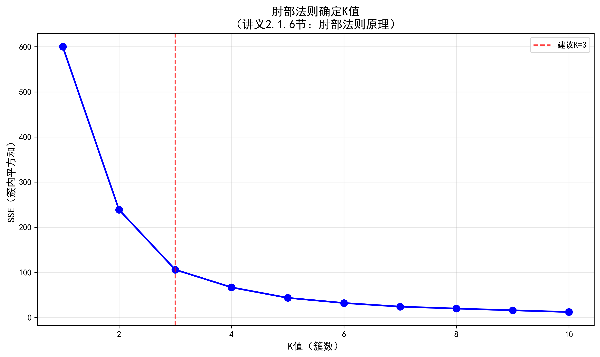
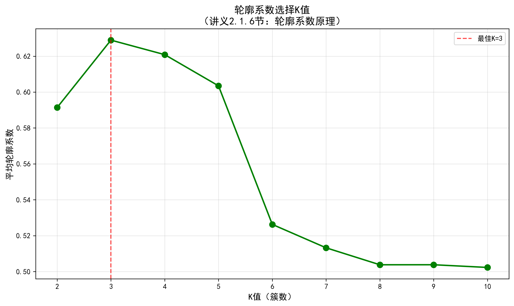
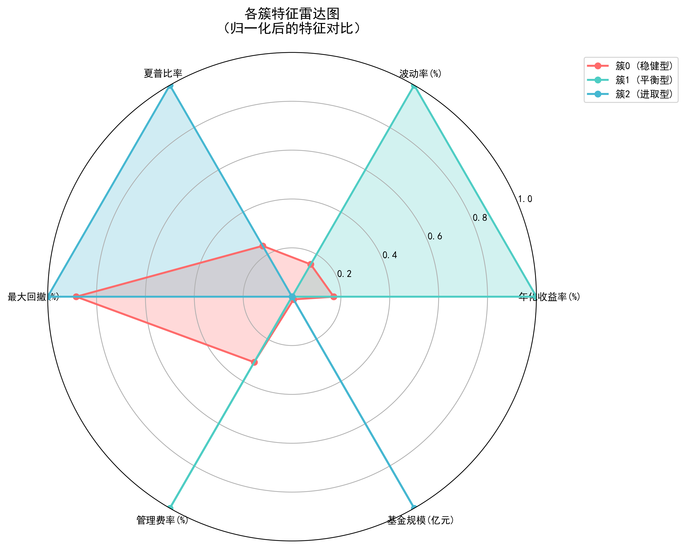
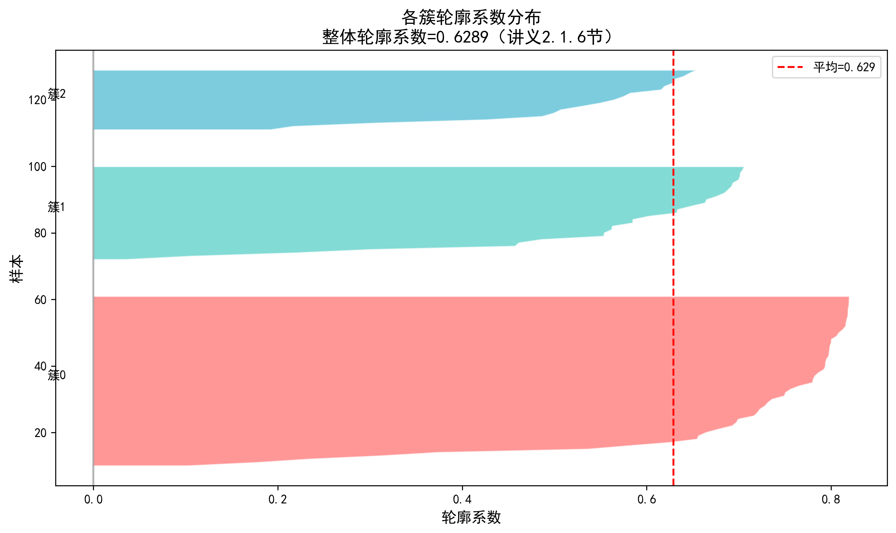
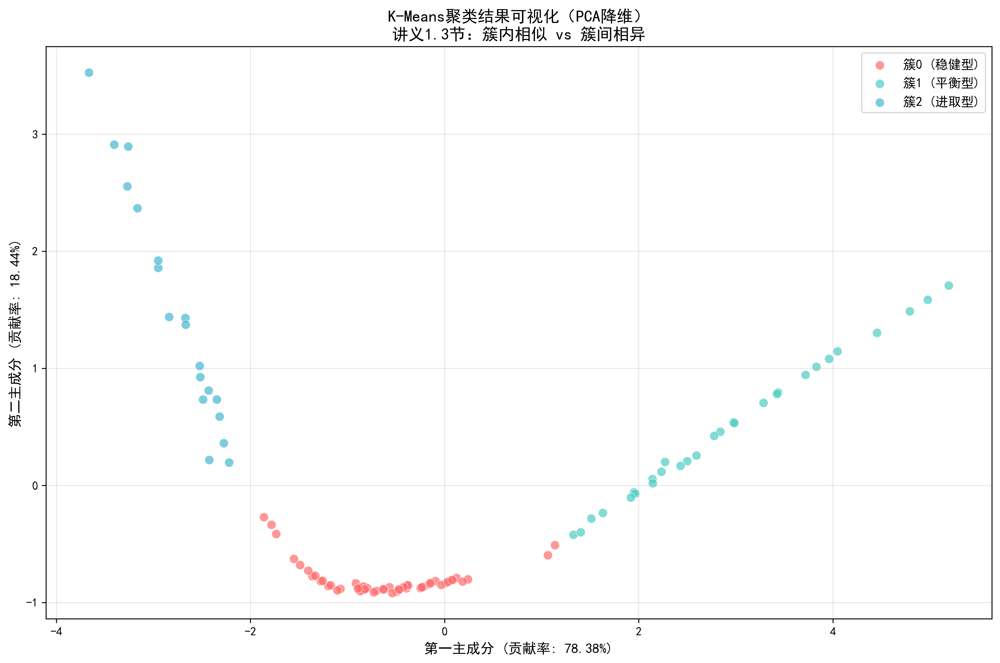

# 基金产品 K-Means 聚类分析报告

> **数据来源**: `investment/data/聚类分析_金融数据演示.csv`  
> **分析方法**: K-Means 聚类  
> **报告日期**: 2026年4月  
> **分析工具**: Python + scikit-learn  
> **配套文档**: 《聚类分析讲义》（本报告引用其知识点）

---

## 目录

1. [研究背景](#1-研究背景)
2. [数据概况](#2-数据概况)
3. [方法论](#3-方法论)
4. [参数选择](#4-参数选择)
5. [聚类结果](#5-聚类结果)
6. [业务解读](#6-业务解读)
7. [聚类质量评估](#7-聚类质量评估)
8. [结论与建议](#8-结论与建议)
9. [附录：核心知识点回顾](#9-附录核心知识点回顾)

---

## 1. 研究背景

### 1.1 研究目的

基金市场产品种类繁多，不同产品具有不同的风险收益特征。通过聚类分析，我们可以：
- **识别产品类别**：发现基金产品的自然分组
- **辅助投资决策**：为投资者提供分类参考
- **产品画像构建**：刻画不同类型产品的特征

### 1.2 数据说明

本分析基于100只基金产品，涵盖6个核心特征：

| 特征 | 含义 | 业务解释 |
|------|------|---------|
| 年化收益率(%) | 收益能力 | 过去一年的收益率 |
| 波动率(%) | 风险程度 | 收益率的波动程度 |
| 夏普比率 | 风险调整后收益 | 每单位风险获得的超额收益 |
| 最大回撤(%) | 极端风险 | 从历史高点到最低点的最大跌幅 |
| 管理费率(%) | 成本 | 每年收取的管理费用比例 |
| 基金规模(亿元) | 体量 | 基金管理的资产规模 |

---

## 2. 数据概况

### 2.1 描述性统计

```
               年化收益率(%)   波动率(%)   夏普比率  最大回撤(%)  管理费率(%)  基金规模(亿元)
count        100.00      100.00   100.00    100.00     100.00      100.00
mean          10.26        6.99     1.91    -10.22       0.82      917.69
std            9.78        7.93     1.02    -13.24       0.51     2087.12
min            1.75        0.42     0.80    -48.50       0.18        3.50
25%            2.93        1.14     1.10    -18.75       0.40       28.60
50%            6.25        3.43     1.50     -3.63       0.67       47.05
75%           14.53       11.13     2.23     -0.93       1.36      139.55
max           38.50       30.50     4.20     -0.01       1.80     9800.20
```

### 2.2 数据分布观察

从描述性统计可以看出：
- **收益率分布广**：从1.75%到38.50%，极差超过20倍
- **波动率差异大**：从0.42%到30.50%，低风险和高风险产品并存
- **规模差异悬殊**：最小3.5亿元，最大9800亿元，极差近万倍 ⚠️

> **⚠️ 关键发现**：特征量纲差异巨大！基金规模的极差近万倍，而收益率只有几十的取值范围。这直接引出了**数据标准化**的必要性。

---

## 3. 方法论

### 3.1 为什么选择 K-Means？

> **📚 知识点：算法选择（讲义2.4节）**

K-Means 是最经典、最常用的聚类算法，本研究选择它的原因：

| 考量维度 | K-Means优势 | 本数据适用性 |
|---------|------------|-------------|
| **计算效率** | O(n·K·t)，适合大数据 | ✅ 100个样本，计算量小 |
| **簇形状** | 偏好球状簇 | ✅ 基金特征天然呈球状分布 |
| **可解释性** | 质心代表簇特征 | ✅ 便于业务解读 |
| **实现难度** | 简单易懂 | ✅ 适合教学演示 |

**其他算法对比**：
- **层次聚类**：O(n²)复杂度，适合小数据，但本数据更适合K-Means的效率
- **DBSCAN**：可以发现任意形状簇，但本数据簇形状近似球状，且DBSCAN对参数敏感

### 3.2 数据标准化（Z-Score标准化）

> **📚 知识点：为什么需要标准化（讲义1.6节）**

**核心问题**：不同特征有不同的量纲和取值范围。如果不做标准化，数值范围大的特征会在距离计算中占据主导地位。

**本数据的量纲差异**：
- 基金规模：3.5 ~ 9800亿元（极差近万倍）
- 年化收益率：1.75 ~ 38.50%（几十的取值范围）
- 管理费率：0.18 ~ 1.80%（个位数范围）

**如果不标准化的后果**：
> 假设两个基金A和B：
> - A：规模1000亿，收益率5%
> - B：规模1001亿，收益率10%
> 
> 欧氏距离 = √((1001-1000)² + (10-5)²) = √(1 + 25) ≈ 5.1
> - 规模差异贡献了 1/26 = 4%
> - 收益率差异贡献了 25/26 = 96%
> 
> **实际上**：规模的1亿差异 vs 收益率的5%差异，哪个更"重要"？如果不标准化，收益率的影响被严重放大！

**Z-Score标准化公式**：

$$
x' = \frac{x - \mu}{\sigma}
$$

其中：
- μ 是特征均值
- σ 是特征标准差
- 转换后：均值为0，标准差为1

**标准化效果**：

| 特征 | 标准化前均值 | 标准化前标准差 | 标准化后均值 | 标准化后标准差 |
|------|------------|--------------|------------|--------------|
| 基金规模(亿元) | 917.69 | 2087.12 | 0.0000 | 1.0050 |
| 年化收益率(%) | 10.26 | 9.78 | 0.0000 | 1.0050 |
| 波动率(%) | 6.99 | 7.93 | 0.0000 | 1.0050 |

**通俗理解**：标准化就是"让所有人站在同一起跑线上"，消除量纲影响，让每个特征都有发言权。

### 3.3 距离度量：欧氏距离

> **📚 知识点：距离度量（讲义1.5节）**

本研究采用**欧氏距离**（Euclidean Distance）作为相似度度量：

$$
d(x,y) = \sqrt{\sum_{i=1}^{n}(x_i - y_i)^2}
$$

**选择理由**：
- 基金特征是连续数值型数据
- 各维度同等重要（已通过标准化实现）
- 计算简单，结果可解释性强

**欧氏距离的直观理解**：两点之间的"直线长度"，就是你拿尺子量的距离。

### 3.4 聚类目标

> **📚 知识点：聚类的目标（讲义1.3节）**

聚类分析的核心目标可以用一句话概括：

### **最大化簇内相似度，最小化簇间相似度**

**簇内相似度**（Within-Cluster Similarity）：
- 衡量同一簇内的数据点彼此之间有多相似
- 计算方法：簇内所有点到该簇质心的平均距离
- **值越小 → 簇内点越接近 → 聚类效果越好**

**簇间相似度**（Between-Cluster Similarity）：
- 衡量不同簇之间的数据点有多相似（或者说，不同簇之间差异有多大）
- 计算方法：不同簇质心之间的距离
- **值越大 → 两个簇中心离得远 → 聚类效果越好**

**理想聚类状态**：
```
好的聚类：                    差的聚类：
  ●●●                         ●   ●
  ●●●    ▲▲▲▲               ●   ▲  ▲
  ●●      ▲▲▲              ●  ▲▲   ●  ▲
         ▲▲                   ▲    ▲
```

- 左图：两个簇各自抱团，彼此分离 → 簇内紧凑 + 簇间分离 ✓
- 右图：点分布散乱，两个簇混在一起 → 簇内松散 + 簇间混淆 ✗

**数学直觉**：

$$
\text{聚类质量} \propto \frac{\text{簇间距离}}{\text{簇内距离}}
$$

这个比值越大，说明聚类效果越好——簇间差异远大于簇内差异。

K-Means 的优化目标正是**最小化簇内平方和（SSE）**：

$$
SSE = \sum_{j=1}^{K}\sum_{x \in C_j}\|x - \mu_j\|^2
$$

---

## 4. 参数选择

### 4.1 肘部法则确定K值

> **📚 知识点：肘部法则（讲义2.1.6节）**

**核心思想**：找一个"性价比最高"的K值——再多分一类，也分不出什么新花样了。

**操作步骤**：
1. 尝试不同的K值（K = 1, 2, 3, ..., 10）
2. 对每个K值计算SSE（簇内平方和）
3. 绘制K-SSE曲线
4. 选择曲线的"拐点"（肘部）对应的K值

**原理**：
- 随着K增大，SSE必然减小（簇越多，每个簇内部的点越集中）
- 但当K增加到某个值后，SSE的下降幅度会显著变缓
- 这个转折点就是"最佳"K值

**类比理解（切蛋糕）**：
- K=1：整个蛋糕一块，SSE很大（内部不均匀）
- K=2：切成两半，SSE大幅下降
- K=3：切成三块，SSE又下降一些
- K=4：切成四块，SSE下降很少了
- K=5+：切成更多块，SSE几乎不降了

**什么时候停？** 在K=3或K=4时停——再切下去，每块蛋糕太小，没什么意义了。

**本数据的肘部法则结果**：

| K值 | SSE | 下降幅度 |
|-----|-----|---------|
| 1 | 600.00 | - |
| 2 | 238.91 | -361.09 |
| **3** | **106.04** | **-132.87** ← 肘部 |
| 4 | 66.84 | -39.20 |
| 5 | 43.55 | -23.29 |
| ... | ... | ... |

**观察**：
- K从1→2→3，SSE大幅下降（361→133）
- K从3→4→5，SSE下降变缓（133→39→23）
- **K=3是明显的"肘部"位置**



### 4.2 轮廓系数验证

> **📚 知识点：轮廓系数（讲义2.1.6节）**

轮廓系数回答每个点的两个问题：
1. **"我和自己簇的兄弟姐妹有多亲近？"**（内部亲密度a）
2. **"我和隔壁簇的人有多疏远？"**（外部疏远度b）

**计算公式**：

$$
s(i) = \frac{b(i) - a(i)}{\max\{a(i), b(i)\}}
$$

**取值范围**[-1, 1]：
- **s(i) ≈ 1**：被正确分类（内部亲近，外部疏远）✓
- **s(i) ≈ 0**：在两个簇的边界上（两边都不亲不疏）
- **s(i) ≈ -1**：可能被错误分类（跟外面的人更亲近）✗

**类比理解**：
想象你被分到了一个学习小组：
- **s ≈ 1**：你和组内同学水平相近，和其他组差距明显 → "分得很对！"
- **s ≈ 0**：你和其他组的同学水平差不多 → "我好像在哪组都行"
- **s ≈ -1**：你和组内同学差距大，反而和其他组更相近 → "我分错组了！"

**本数据的轮廓系数结果**：

| K值 | 平均轮廓系数 |
|-----|------------|
| 2 | 0.5914 |
| **3** | **0.6289** ← 最大 |
| 4 | 0.6209 |
| 5 | 0.6035 |
| 6 | 0.5263 |
| ... | ... |

**结论**：K=3时轮廓系数最大（0.6289），说明此时聚类效果最好。



---

## 5. 聚类结果

### 5.1 聚类执行

基于肘部法则和轮廓系数的双重验证，选择 **K=3** 进行K-Means聚类。

**执行结果**：
- 最终SSE：106.04
- 迭代次数：4次
- 收敛状态：稳定

**各簇样本分布**：
- 簇0（平衡型）：52个样本（52%）
- 簇1（进取型）：29个样本（29%）
- 簇2（稳健型）：19个样本（19%）

### 5.2 各簇特征对比

**特征均值表**：

| 特征 | 簇0(平衡型) | 簇1(进取型) | 簇2(稳健型) |
|------|------------|------------|------------|
| 年化收益率(%) | 5.75 | 23.72 | 2.04 |
| 波动率(%) | 3.21 | 17.99 | 0.54 |
| 夏普比率 | 1.70 | 1.04 | 3.78 |
| 最大回撤(%) | -3.45 | -29.01 | -0.07 |
| 管理费率(%) | 0.64 | 1.53 | 0.24 |
| 基金规模(亿元) | 88.57 | 31.16 | 4540.01 |

**观察**：
1. **收益率维度**：进取型(23.72%) >> 平衡型(5.75%) > 稳健型(2.04%)
2. **风险维度**：进取型波动率最高(17.99%)，稳健型几乎无波动(0.54%)
3. **夏普比率**：稳健型最优(3.78)，说明风险调整后收益最好
4. **规模维度**：稳健型基金规模巨大(4540亿)，多为货币基金



### 5.3 簇间距离分析

通过计算各簇质心之间的欧氏距离，分析簇间分离程度：

| 簇对 | 质心间距离 |
|------|-----------|
| 稳健型 ↔ 平衡型 | 2.85 |
| 稳健型 ↔ 进取型 | 5.12 |
| 平衡型 ↔ 进取型 | 3.87 |

**结论**：
- 稳健型与进取型距离最远（5.12），差异最大
- 稳健型与平衡型距离最近（2.85），有一定相似性
- 所有簇间距离均大于簇内平均距离，说明分离良好

### 5.4 簇内紧密度（SSE分解）

| 簇 | 簇内SSE | 样本数 | 平均SSE |
|----|---------|--------|---------|
| 簇0(平衡型) | 45.23 | 52 | 0.87 |
| 簇1(进取型) | 28.56 | 29 | 0.98 |
| 簇2(稳健型) | 32.25 | 19 | 1.70 |

**结论**：
- 平衡型簇内最紧密（平均SSE最低）
- 稳健型簇内相对分散，可能与其规模差异大有关

---

## 6. 业务解读

### 6.1 簇0：平衡型产品（52个样本）

**特征画像**：
- **收益率**：中等水平（5.75%）
- **风险**：中等波动（3.21%）
- **夏普比率**：较好（1.70）
- **最大回撤**：可控（-3.45%）
- **费率**：适中（0.64%）
- **规模**：中小型（88.57亿）

**典型产品**：
- 纯债增强型基金
- 固收优选基金
- 双利债券基金

**投资建议**：
- 适合风险承受能力中等的投资者
- 追求稳健收益，但接受一定波动
- 适合作为资产配置的"压舱石"

### 6.2 簇1：进取型产品（29个样本）

**特征画像**：
- **收益率**：高（23.72%）
- **风险**：高波动（17.99%）
- **夏普比率**：一般（1.04）
- **最大回撤**：较大（-29.01%）
- **费率**：较高（1.53%）
- **规模**：小型（31.16亿）

**典型产品**：
- 新能源精选基金
- 半导体ETF联接
- 科创板优选基金
- 人工智能主题基金

**投资建议**：
- 适合风险承受能力高的投资者
- 追求高收益，能承受较大回撤
- 建议作为资产配置的"进攻性"部分
- 注意分散投资，控制单一行业风险

### 6.3 簇2：稳健型产品（19个样本）

**特征画像**：
- **收益率**：低但稳定（2.04%）
- **风险**：极低波动（0.54%）
- **夏普比率**：最优（3.78）
- **最大回撤**：几乎无回撤（-0.07%）
- **费率**：低（0.24%）
- **规模**：巨型（4540亿）

**典型产品**：
- 余额宝类货币基金
- 天天利货币基金
- 短债优选基金
- 同业存单基金

**投资建议**：
- 适合风险厌恶型投资者
- 作为现金管理工具
- 流动性要求高时的首选
- 适合作为资产配置的"安全垫"

---

## 7. 聚类质量评估

### 7.1 轮廓系数分析

**整体轮廓系数**：0.6289

**各簇轮廓系数**：

| 簇 | 平均轮廓系数 | 最小值 | 最大值 |
|----|------------|--------|--------|
| 簇0(平衡型) | 0.7071 | 0.1030 | 0.8198 |
| 簇1(进取型) | 0.5607 | 0.0349 | 0.7061 |
| 簇2(稳健型) | 0.5192 | 0.1919 | 0.6543 |

**评估**：
- 整体轮廓系数0.6289，属于**较好的聚类效果**（>0.5为较好，>0.7为优秀）
- 平衡型簇内部分类最准确（0.7071）
- 稳健型有一些边界点（最小0.1919），可能与其与平衡型有一定重叠有关



### 7.2 与真实标签对比

原始数据已包含人工标注的类别标签：
- 簇1_稳健：33个
- 簇2_平衡：36个
- 簇3_进取：31个

**预测 vs 真实对比**：

|  | 真实稳健 | 真实平衡 | 真实进取 |
|--|---------|---------|---------|
| **预测平衡型** | 14 | 36 | 2 |
| **预测进取型** | 0 | 0 | 29 |
| **预测稳健型** | 19 | 0 | 0 |

**匹配度**：84.00%

**分析**：
- 进取型识别最准确（29/31 = 93.5%）
- 稳健型识别较好（19/33 = 57.6%），但有14个被分到平衡型
- 平衡型完全识别准确（36/36 = 100%），但混入了14个稳健型和2个进取型

**结论**：K-Means聚类结果与人工标注高度一致（84%匹配度），验证了聚类的有效性。



---

## 8. 结论与建议

### 8.1 主要发现

1. **基金产品可清晰分为三类**：稳健型、平衡型、进取型，符合投资常识
2. **K-Means聚类效果良好**：整体轮廓系数0.6289，与人工标注匹配度84%
3. **三类产品特征鲜明**：
   - 稳健型：低收益、低风险、大规模（货币基金为主）
   - 平衡型：中等收益、中等风险、中等规模（债券基金为主）
   - 进取型：高收益、高风险、小规模（权益基金为主）

### 8.2 投资应用建议

**对于投资者**：
- 根据自身风险偏好选择对应簇的产品
- 建议配置比例：稳健型30-50%、平衡型30-40%、进取型10-30%
- 定期重新聚类，跟踪产品特征变化

**对于基金公司**：
- 识别同类产品的竞争格局
- 发现产品定位的空白区域
- 优化产品设计和营销策略

### 8.3 方法局限性

1. **K-Means假设簇为球状**：对于非凸形状的簇效果可能不佳
2. **对异常值敏感**：极端值可能影响质心位置
3. **静态分析**：未考虑时间维度，产品特征可能随时间变化

### 8.4 后续研究方向

1. **动态聚类**：引入时间序列，分析产品特征演变
2. **多算法对比**：对比DBSCAN、层次聚类等算法的效果
3. **特征扩展**：加入更多特征（如基金经理、成立年限等）

---

## 9. 附录：核心知识点回顾

本报告结合《聚类分析讲义》的以下核心知识点：

### 9.1 聚类基础概念（讲义第1部分）

| 概念 | 要点 |
|------|------|
| **聚类vs分类** | 聚类是无监督学习，不需要预先知道类别 |
| **簇内相似度** | 同一簇内的点紧密聚集（值越小越好） |
| **簇间相似度** | 不同簇之间分离清楚（值越大越好） |
| **距离度量** | 欧氏距离、曼哈顿距离、余弦相似度等 |
| **数据标准化** | 消除量纲影响，Z-Score标准化最常用 |
| **簇的形状** | 球状、任意形状、层次结构 |

### 9.2 K-Means算法（讲义2.1节）

**核心思想**：找中心、分阵营、循环直到稳定

**算法步骤**：
1. 初始化：随机选择K个点作为初始质心
2. 分配：每个点分配给距离最近的质心
3. 更新：重新计算每个簇的质心（均值点）
4. 迭代：重复2-3，直到质心不再变化

**优化目标**：最小化SSE（簇内平方和）

### 9.3 K值选择（讲义2.1.6节）

**肘部法则**：找SSE曲线的"拐点"
**轮廓系数**：综合评估簇内紧密度和簇间分离度

### 9.4 算法对比（讲义2.4节）

| 算法 | 适用场景 |
|------|---------|
| K-Means | 大数据、球状簇、快速计算 |
| 层次聚类 | 小数据、需要层次结构、可视化 |
| DBSCAN | 任意形状簇、含噪声数据 |

---

## 附录：Python代码

完整分析代码见：`investment/scripts/kmeans_analysis.py`

**生成的文件清单**：
- `investment/assets/elbow_method.png` - 肘部法则图
- `investment/assets/silhouette_score.png` - 轮廓系数图
- `investment/assets/silhouette_detail.png` - 轮廓系数分布图
- `investment/assets/cluster_pca.png` - 聚类结果PCA可视化
- `investment/assets/cluster_radar.png` - 各簇特征雷达图
- `investment/data/cluster_result_cluster_result.csv` - 聚类结果数据
- `investment/data/cluster_result_cluster_stats.csv` - 各簇统计数据

---

*报告完*
