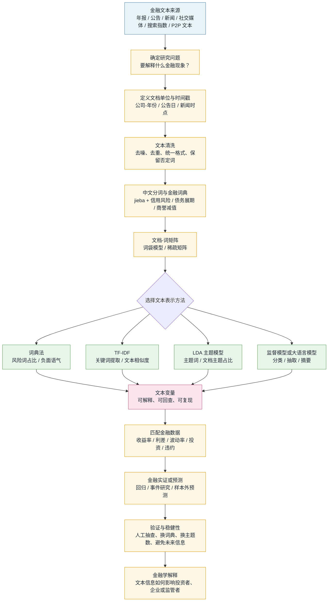

# 文本分析方法与金融应用：从 TF-IDF、LDA 到金融文本大数据

## 一、为什么金融学需要文本分析

传统金融数据大多是结构化数据：价格、成交量、财务报表项目、利率、评级、违约状态等。这些数据像已经填好的表格，每一列含义明确，机器天然容易处理。但金融市场每天还产生大量非结构化文本：年报、招股书、公告、监管问询函、分析师报告、新闻、研报电话会议纪要、社交媒体帖子、论坛评论、基金经理访谈、央行声明、政策文件等。

姚加权、张锟澎和罗平（2020）把金融学文本大数据的重要来源概括为上市公司披露文本、财经媒体报道、社交网络文本、网络搜索指数和 P2P 网络借贷文本等，并指出相关研究通常围绕文本可读性、语气语调、相似性和语义特征展开。 这个分类很适合作为学习金融文本分析的路线图：先弄清文本从哪里来，再考虑如何把文本转成可检验的金融变量。

这些文本里包含很多表格里没有的信息。例如：

- 年报中的“风险因素”会透露管理层如何描述不确定性。
- 电话会议问答部分能反映分析师最关心的问题，也能暴露管理层是否回避关键议题。
- 新闻报道和社交媒体能捕捉投资者情绪、市场关注点和突发事件传播速度。
- 央行声明里的措辞变化，可能影响市场对未来利率路径的预期。
- ESG 报告和可持续发展报告里存在大量承诺、叙事和披露细节，适合用文本方法识别企业行为与“漂绿”风险。

文本分析的核心任务，是把“人读得懂但机器不好算”的语言，转换成“机器能统计、能建模、能和金融变量连接”的特征。它不是为了替代阅读，而是为了在海量文本中稳定、可复现地提取信息。

可以用一个类比来理解：结构化金融数据像超市货架上的商品条码，扫一下就知道价格和类别；文本数据像顾客的长篇评价，信息更丰富，但必须先拆句、分词、识别重点，再变成可以比较的指标。

更具体地说，文本分析通常走这样一条路：



这条路里最容易出错的不是模型，而是前两步：文本单位定义错了、时间戳对不上、分词把关键词切坏了、停用词删掉了关键否定词。后面的模型再漂亮，也只是把前面的错误放大。

如果是第一次学，可以按下面的顺序读：

1. 先理解“文档、词项、词表、文档-词矩阵”这几个基本对象。
2. 再学 TF-IDF，因为它回答“哪些词对这篇文章最有代表性”。
3. 再学 LDA，因为它回答“一批文章大致讨论哪些主题”。
4. 最后看金融应用，把文本变量接到收益率、利差、波动率、投资和违约等金融变量上。

不要一开始就纠结复杂模型。金融文本分析的关键不是“模型名字高级”，而是“文本变量能否解释清楚，能否被复现，能否服务一个明确的金融问题”。

## 二、文本分析中的常见概念

先用一张小表把几个容易混淆的概念放在一起：

| 概念 | 通俗解释 | 在金融文本中的例子 | 常见错误 |
|---|---|---|---|
| 语料库 | 一批文本的集合 | 2010-2024 年所有上市公司年报 | 只下载了部分公司却当成全市场 |
| 文档 | 一个分析单位 | 一份年报、一条公告、一段电话会议回答 | 文档单位太粗或太细 |
| 词项 | 计数的基本单位 | 信用风险、商誉减值、债务展期 | 中文分词把专有词切碎 |
| 词表 | 全部词项的集合 | 所有年报中出现过的金融词 | 把乱码、页码也纳入词表 |
| 文档-词矩阵 | 文档 × 词项的表 | 每家公司年报中每个词出现几次 | 忘记矩阵大多是 0 |
| 文本变量 | 从文本中构造出的数值 | 风险词占比、主题占比、负面语气 | 变量没有经济含义 |

### 1. 语料库、文档、词项

**语料库** 是一批文本的集合。例如，2000-2025 年所有 A 股上市公司年报，或某财经网站过去 10 年的全部新闻。

**文档** 是语料库中的一个文本单位。它可以是一篇年报、一条新闻、一段电话会议发言，也可以是一条社交媒体评论。文档单位怎么定义，会直接影响研究结论。研究年报语气时，一份年报是一篇文档；研究电话会议互动时，一个问题或一个回答也可以是一篇文档。

**词项** 是模型用来计数的基本单位。英文里通常是单词或词组；中文里需要先分词，把“信用风险上升”切成“信用风险 / 上升”，或“信用 / 风险 / 上升”。金融文本中，“信用风险”“流动性风险”“再融资压力”这类短语经常比单字或单词更有信息量。

下面用一个很小的 `DataFrame` 表示语料库。每一行是一篇文档，`doc_id` 是文档编号，`firm` 和 `year` 是后续可以和金融数据匹配的键。

```python
import pandas as pd

corpus = pd.DataFrame({
    "doc_id": [1, 2, 3],
    "firm": ["A银行", "B地产", "C科技"],
    "year": [2024, 2024, 2024],
    "text": [
        "公司信用风险有所上升，不良贷款率提高。",
        "短期债务集中到期，公司正在推进债务展期。",
        "公司加大人工智能研发投入，新增多项专利。",
    ],
})

print("语料库包含的文档数：", len(corpus))
print(corpus[["doc_id", "firm", "year"]])
print("第一篇文档：", corpus.loc[0, "text"])
```

如果把第一篇文档分词，得到的每个词就是模型后续使用的词项。中文分词是否合理，会影响全部后续结果。

这里有一个很重要的判断：**文档单位必须和研究问题一致**。如果研究“公司年度风险披露”，一份年报或年报风险章节可以是一篇文档；如果研究“管理层是否回避分析师问题”，一整场电话会议太粗，最好把每个问题和每个回答拆成文档；如果研究“新闻发布后的分钟级市场反应”，一条新闻就是文档，发布时间还要精确到分钟。

### 2. 分词、清洗和停用词

文本进入模型前通常要预处理：

- 去掉 HTML 标签、页眉页脚、表格残片、乱码。
- 统一大小写、全角半角、繁简体、数字格式。
- 中文分词，英文词形还原。
- 去掉停用词，如“的”“了”“and”“the”等高频但低信息量词。
- 保留金融专有词，如“商誉减值”“久期”“资本充足率”“流动性覆盖率”。

这里的关键不是“清洗得越干净越好”，而是“清洗规则要服务研究问题”。例如，研究语气时，否定词“未”“不”“无”不能随便删；研究监管措辞时，“应当”“不得”“可以”这类助动词也可能很重要。

下面用 `jieba` 做一个基础清洗和分词示例。金融术语最好手动加入词典，否则“信用风险”“债务展期”可能被拆开。

```python
import re
import jieba

finance_terms = ["信用风险", "不良贷款率", "短期债务", "债务展期", "人工智能", "研发投入"]
for word in finance_terms:
    jieba.add_word(word)

stop_words = {"公司", "有所", "正在", "多项"}

def clean_text(text):
    # 保留中文、英文和数字，其他符号替换为空格。
    return re.sub(r"[^\u4e00-\u9fa5A-Za-z0-9]+", " ", text)

def tokenize_zh(text):
    text = clean_text(text)
    words = jieba.lcut(text)
    return [
        word.strip()
        for word in words
        if len(word.strip()) >= 2 and word.strip() not in stop_words
    ]

corpus["tokens"] = corpus["text"].apply(tokenize_zh)
print(corpus[["firm", "tokens"]])
```

可能的输出大致是：

```text
  firm                tokens
0  A银行  [信用风险, 上升, 不良贷款率]
1  B地产  [短期债务, 集中, 到期, 推进, 债务展期]
2  C科技  [加大, 人工智能, 研发投入, 新增, 专利]
```

这个例子也说明：停用词不是固定答案。比如“上升”“下降”在金融风险研究中很重要，不能轻易删除。

清洗和分词可以用下面这张检查表自查：

| 检查点 | 为什么重要 | 例子 |
|---|---|---|
| 是否保留否定词 | 否定词会改变方向 | “未发生违约”不能删掉“未” |
| 是否加入金融词典 | 专有词拆碎会损失含义 | “商誉减值”不应拆成“商誉 / 减值”以外的怪词 |
| 是否去掉模板噪音 | 模板会稀释真实信息 | “本公司董事会保证……”通常不代表经营风险 |
| 是否处理重复文本 | 重复会放大某些表述 | 同一公告被多个来源转载 |
| 是否保存原文索引 | 便于回查和纠错 | 每个变量能追溯到原始公告 |

### 3. 词袋模型

词袋模型（Bag of Words）把一篇文章看成一袋词，只关心词出现了几次，不关心词的顺序。

例如：

> “银行面临信用风险和流动性风险”

在词袋模型里可能变成：

| 词项 | 次数 |
|---|---:|
| 银行 | 1 |
| 面临 | 1 |
| 信用风险 | 1 |
| 流动性风险 | 1 |

它的缺点很明显：忽略语序，也难以理解“风险没有上升”和“风险明显上升”的区别。但它有一个巨大优点：简单、透明、可解释。TF-IDF 和 LDA 都建立在这个基础上，很多金融实证研究也仍然从词袋模型开始。

可以把词袋模型想象成“把一篇文章倒进透明袋子，只数里面有哪些积木块”。它不知道积木原来搭成了房子还是桥，但它能快速比较两袋积木是否相似。

用 Python 可以直接把分词结果转成词袋矩阵。这里用 `CountVectorizer`，并让它接收我们写好的 `tokenize_zh` 分词函数。

```python
from sklearn.feature_extraction.text import CountVectorizer

count_vectorizer = CountVectorizer(
    tokenizer=tokenize_zh,
    token_pattern=None,
)

bow_matrix = count_vectorizer.fit_transform(corpus["text"])
terms = count_vectorizer.get_feature_names_out()

bow_df = pd.DataFrame(
    bow_matrix.toarray(),
    columns=terms,
    index=corpus["firm"],
)

print(bow_df)
```

输出矩阵的含义是：每一行是一篇文档，每一列是一个词项，单元格表示这个词在该文档中出现了几次。比如 `A银行` 那一行里，`信用风险` 和 `不良贷款率` 的计数会比较高。

可以把文档-词矩阵看成一张“文本资产负债表”：行是公司或文档，列是词项，数值是每个词出现了几次。金融模型不能直接读文章，但可以读这张表。TF-IDF、LDA、分类模型，很多都从这张表开始。

### 4. 稀疏矩阵

真实语料库里的词表可能有几万甚至几十万个词，而每篇文档只包含其中很小一部分。因此，文本数据转成矩阵后通常非常稀疏。

假设有 10000 篇年报、50000 个词项，就会得到一个 10000 × 50000 的矩阵。每一行是一篇年报，每一列是一个词，大部分格子都是 0。稀疏矩阵是文本分析的常态，不是异常。

`scikit-learn` 默认返回稀疏矩阵，而不是普通二维数组。这样能节省大量内存。

```python
print(type(bow_matrix))
print("矩阵形状：", bow_matrix.shape)
print("非零元素个数：", bow_matrix.nnz)

total_cells = bow_matrix.shape[0] * bow_matrix.shape[1]
sparsity = 1 - bow_matrix.nnz / total_cells
print("稀疏率：", round(sparsity, 3))
```

如果有 10000 篇文档和 50000 个词项，普通矩阵有 5 亿个格子。绝大多数格子都是 0，用稀疏矩阵只保存非零位置，就像只记录“哪些货架上真的有商品”，而不是把整个空仓库也逐格登记下来。

稀疏矩阵还有一个实践含义：不要轻易把大规模文本矩阵 `.toarray()`。小例子可以转成普通表格方便看，大样本会直接占满内存。真实项目中通常让模型直接吃稀疏矩阵。

### 5. 文本特征与金融变量

文本分析最终常常要生成一个或多个变量，再进入金融学的研究框架。例如：

- 年报负面语气 = 负面词数量 / 总词数
- 风险披露强度 = 风险相关词频
- 产品相似度 = 两家公司业务描述的余弦相似度
- 政策不确定性指数 = 新闻中同时出现“经济”“政策”“不确定”词组的文章占比
- 电话会议乐观程度 = 管理层回答中积极语气得分
- ESG 漂绿风险 = ESG 承诺多、实质行动少、负面事件多的组合指标

这一步是文本分析和金融研究连接的桥。文本模型本身不是结论，只有当它和收益率、波动率、投资、融资约束、违约、治理、创新等金融变量联系起来，才成为金融学问题。

下面构造两个简单文本特征：风险词数量和风险词占比，再把它们与下一期债券利差合并。真实研究中，`bond_spread_next` 可以来自 Wind、CSMAR、Bloomberg 或交易所债券数据。

```python
risk_words = {"信用风险", "不良贷款率", "短期债务", "债务展期"}

def risk_word_count(tokens):
    return sum(1 for word in tokens if word in risk_words)

corpus["risk_word_count"] = corpus["tokens"].apply(risk_word_count)
corpus["token_count"] = corpus["tokens"].apply(len)
corpus["risk_word_share"] = corpus["risk_word_count"] / corpus["token_count"]

finance_data = pd.DataFrame({
    "firm": ["A银行", "B地产", "C科技"],
    "year": [2024, 2024, 2024],
    "bond_spread_next": [1.85, 4.80, 1.30],
    "leverage": [0.88, 0.82, 0.30],
})

analysis_df = corpus.merge(finance_data, on=["firm", "year"], how="left")

print(analysis_df[[
    "firm", "year", "risk_word_count", "risk_word_share",
    "bond_spread_next", "leverage"
]])
```

得到的 `analysis_df` 就是文本分析进入金融实证的起点。后续可以做描述统计、分组比较、回归或预测模型。例如，初步查看风险词占比和下一期债券利差的关系：

```python
print(
    analysis_df[["risk_word_share", "bond_spread_next"]]
    .corr()
    .round(3)
)
```

样本很小时，相关系数没有严肃统计意义；它只是展示变量如何从文本中生成，并与金融数据连接。

这里要区分三个层次：

| 层次 | 例子 | 作用 |
|---|---|---|
| 文本原始材料 | 年报、新闻、公告 | 信息来源 |
| 文本特征 | 风险词占比、TF-IDF 向量、主题占比 | 把语言变成数字 |
| 金融变量 | 利差、收益率、波动率、投资率 | 要解释或预测的经济结果 |

很多初学者会跳过中间层，直接说“文本影响收益率”。更严谨的说法应是：某种文本特征，例如风险披露强度或负面语气，与后续收益率、利差或波动率存在关系。

## 三、常见文本分析方法概览

文本分析方法可以按复杂程度分成四类。

### 1. 词典法

词典法先定义一组词，再统计这些词在文档中出现的频率。例如，用“亏损、诉讼、违约、下滑、处罚”衡量负面语气，用“不确定、可能、预计、取决于”衡量不确定性。

优点是透明、容易复现、解释清楚。缺点是语境依赖强，词典不合适会导致误判。Loughran 和 McDonald 的经典研究就指出，通用负面词典在金融文本里可能把许多并不负面的词误判为负面。例如 “liability” 在普通语境里偏负面，但在会计语境里常常只是“负债”这一中性科目。[^loughran]

类比一下：词典法像安检名单。名单上有某些关键词，系统就会提醒。但如果名单来自机场安检，直接拿去检查医院病历，误报会很多。

用前面已经分好词的 `corpus`，可以写一个极简金融风险词典。它的作用不是“理解整篇文章”，而是先粗略数出风险相关表达出现了多少。

```python
risk_words = {"信用风险", "不良贷款率", "短期债务", "债务展期"}

def risk_word_count(tokens):
    return sum(1 for word in tokens if word in risk_words)

corpus["risk_word_count"] = corpus["tokens"].apply(risk_word_count)
corpus["token_count"] = corpus["tokens"].apply(len)
corpus["risk_word_share"] = corpus["risk_word_count"] / corpus["token_count"]

print(corpus[["firm", "tokens", "risk_word_count", "risk_word_share"]])
```

如果 `B地产` 的 `risk_word_share` 更高，说明它的文本更集中地谈到债务压力。但这还不是结论，只是一个需要进一步验证的文本变量。

### 2. TF-IDF 和相似度分析

TF-IDF 用来衡量一个词对某篇文档的重要程度。它不仅看词在文档中出现多少次，也看这个词在整个语料库中是否常见。后文会详细讲。

在金融研究中，TF-IDF 常用于：

- 计算公司业务描述相似度，识别真实竞争对手。
- 比较政策文件或央行声明的措辞变化。
- 从新闻中提取事件关键词。
- 为分类模型提供输入特征。

### 3. 主题模型

主题模型试图从大量文档中自动发现“主题”。LDA 是最经典的主题模型之一。它不会提前要求研究者定义“风险”“创新”“融资”等词典，而是让模型根据词共现模式推断主题。

在金融文本中，LDA 可以用于：

- 从年报中识别常见风险主题，如流动性、诉讼、汇率、供应链。
- 从分析师报告中识别关注主题，如盈利预测、估值、行业景气度、政策影响。
- 从投资者互动平台中识别市场关切，如分红、并购、产能、订单、监管。

### 4. 监督学习、深度学习和大语言模型

如果已有人工标签，就可以训练监督学习模型。例如，把新闻标为“利好、利空、中性”，训练分类器预测新新闻的情绪。

深度学习模型，尤其是 BERT、FinBERT 和金融领域大语言模型，可以捕捉上下文。它们比词袋模型更擅长理解“业绩不及预期”“亏损收窄”“风险有所缓释”这类依赖语境的表达。FinBERT 类模型的出现，正是因为金融文本有大量专有表达，通用语言模型不一定能准确理解。[^finbert]

大语言模型进一步把文本分析从“提取变量”扩展到“问答、摘要、推理、结构化抽取、代码辅助和报告生成”。BloombergGPT 是金融领域专门训练大语言模型的代表，它使用金融数据和通用数据混合训练，目标是服务金融 NLP 任务。[^bloomberggpt]

不过，模型越复杂，越需要警惕可解释性、数据泄漏、幻觉、成本和复现问题。金融研究尤其重视可验证性，不能只因为模型看起来高级就放弃扎实的变量定义和稳健性检验。

## 四、TF-IDF：从“高频词”到“有区分度的词”

### 1. 为什么不能只看词频

最直观的文本分析方法是数词频。某个词在一篇文章里出现越多，似乎越重要。但这会遇到一个问题：很多词高频却没有区分度。

例如，在上市公司年报里，“公司”“业务”“报告期”“管理”“风险”都可能频繁出现。如果只看词频，这些词会压过真正有信息量的词，如“商誉减值”“数据中心”“原材料涨价”“境外制裁”“可转债赎回”。

TF-IDF 的思想是：一个词在某篇文档中频繁出现，说明它对这篇文档可能重要；但如果它在所有文档中都频繁出现，说明它只是常见背景词，应该降权。

这句话可以再拆开一点：

- **TF 解决“这篇文章内部谁更突出”**。如果“债务展期”在一篇公告里反复出现，它对这篇公告就重要。
- **IDF 解决“这个词在全体文章中是否太普通”**。如果“公司”“报告期”每篇年报都有，它就不能帮助区分不同公司。
- **TF-IDF 解决“既在本文突出，又能区分本文和其他文档”**。这类词通常最适合做关键词。

### 2. TF、IDF 和 TF-IDF

TF 是 Term Frequency，词频。常见定义是：

$$
TF(t,d)=\frac{t 在文档 d 中出现的次数}{文档 d 的总词数}
$$

IDF 是 Inverse Document Frequency，逆文档频次。常见定义是：

$$
IDF(t)=\log\frac{N}{DF(t)}
$$

其中，$N$ 是语料库中文档总数，$DF(t)$ 是包含词项 $t$ 的文档数量。

TF-IDF 是二者的乘积：

$$
TFIDF(t,d)=TF(t,d)\times IDF(t)
$$

直觉很简单：

- 如果一个词在某篇文档里出现很多，TF 高。
- 如果一个词只在少数文档中出现，IDF 高。
- 两者都高，说明这个词很可能是这篇文档的“特色词”。

Manning、Raghavan 和 Schütze 的信息检索教材把 TF-IDF 作为搜索和文档表示中的基础权重方法之一。[^manning]

做一个手算例子。假设有 3 篇文档：

| 文档 | 分词后内容 |
|---|---|
| A | 银行、信用风险、信用风险、不良贷款 |
| B | 银行、流动性风险、存款、利率 |
| C | 新能源、电池、原材料涨价 |

“信用风险”在 A 中出现 2 次，A 一共 4 个词，所以：

$$
TF(信用风险,A)=2/4=0.5
$$

“信用风险”只出现在 3 篇文档中的 1 篇，所以：

$$
IDF(信用风险)=\log(3/1)\approx 1.10
$$

因此：

$$
TFIDF(信用风险,A)=0.5\times 1.10=0.55
$$

再看“银行”。它在 A 中出现 1 次：

$$
TF(银行,A)=1/4=0.25
$$

但它出现在 A 和 B 两篇文档里：

$$
IDF(银行)=\log(3/2)\approx 0.41
$$

所以：

$$
TFIDF(银行,A)=0.25\times 0.41=0.10
$$

虽然“银行”也出现在 A 中，但它比“信用风险”更常见，因此权重更低。这就是 TF-IDF 的核心直觉：**高频不一定重要，能区分才重要**。

用前面定义好的 `tokenize_zh`，可以直接把中文金融文本转成 TF-IDF 矩阵。注意这里不是重新发明分词规则，而是复用前面“清洗 + 金融词典 + 停用词”的结果。

```python
from sklearn.feature_extraction.text import TfidfVectorizer

tfidf_vectorizer = TfidfVectorizer(
    tokenizer=tokenize_zh,
    token_pattern=None,
    min_df=1,
    max_df=0.9,
)

tfidf_matrix = tfidf_vectorizer.fit_transform(corpus["text"])
tfidf_terms = tfidf_vectorizer.get_feature_names_out()

print("TF-IDF 矩阵形状：", tfidf_matrix.shape)
print("词表：", list(tfidf_terms))
```

`TfidfVectorizer` 的几个参数也要懂：

| 参数 | 含义 | 什么时候调 |
|---|---|---|
| `tokenizer` | 用什么函数分词 | 中文文本通常要自定义 |
| `token_pattern=None` | 关闭默认英文分词规则 | 使用自定义 tokenizer 时需要 |
| `min_df` | 至少出现在多少篇文档中 | 去掉错别字、乱码、极低频词 |
| `max_df` | 最多出现在多少比例文档中 | 去掉“公司”“报告期”等套话 |
| `ngram_range` | 是否使用词组 | 英文常用；中文更常用分词 + 领域词典 |

### 3. 一个金融小例子

假设有三篇简短文档：

| 文档 | 内容 |
|---|---|
| A | 银行 信用风险 信用风险 不良贷款 |
| B | 银行 流动性风险 存款 利率 |
| C | 新能源 电池 原材料涨价 |

“银行”出现在 A 和 B 中，说明它能区分金融类和新能源类文档，但不能区分 A 和 B。“信用风险”只出现在 A，且出现两次，因此它对 A 的 TF-IDF 权重会较高。“流动性风险”对 B 较重要，“原材料涨价”对 C 较重要。

如果研究问题是“识别银行年报中的主要风险”，TF-IDF 会帮助我们把“信用风险”“不良贷款”“流动性风险”等词从大量套话中提出来。

下面把每篇文档中 TF-IDF 权重最高的词项打印出来。这个结果通常是人工阅读前的“导航图”：先看哪些词最突出，再回到原文确认含义。

```python
def top_tfidf_terms(row_index, top_n=5):
    row = tfidf_matrix[row_index].toarray().ravel()
    top_indices = row.argsort()[::-1][:top_n]
    return [
        (tfidf_terms[i], round(row[i], 4))
        for i in top_indices
        if row[i] > 0
    ]

for i, row in corpus.iterrows():
    print(f"\n{row['firm']}：")
    print(top_tfidf_terms(i, top_n=5))
```

解释 TF-IDF 结果时，可以按三步走：

1. 看高权重词是否像“主题词”，而不是乱码、公司名或格式残片。
2. 回到原文，确认这个词是否真的对应文本重点。
3. 把关键词和金融问题连接起来：它代表风险、增长、创新、治理，还是单纯的行业背景？

### 4. 类比：TF-IDF 像课堂点名

可以把一个词想象成学生，文档想象成课堂。

- TF 问的是：这个学生在这节课发言多不多？
- IDF 问的是：这个学生是不是每节课都发言？
- TF-IDF 问的是：这个学生是否在这节课特别活跃，而且不是哪里都出现？

如果一个学生每节课都说“老师好”，这句话出现很多，但没什么区分度。如果他只在讨论“并购重组”那节课频繁发言，就说明他和这个主题关系很强。

### 5. TF-IDF 在金融研究中的用法

**第一，识别关键词。**  
对一批公告或新闻计算 TF-IDF，可以提取每篇文本最有代表性的词。比如某家公司公告中，“控股权变更”“司法冻结”“债务重组”的权重很高，说明这篇公告的核心不是常规经营，而是控制权和债务问题。

**第二，计算文本相似度。**  
把每篇文档表示成 TF-IDF 向量后，可以计算余弦相似度。两个公司的业务描述越相似，向量夹角越小，相似度越高。Hoberg 和 Phillips 就用 10-K 产品描述构造文本相似度，研究企业之间的产品市场竞争关系。[^hoberg]

余弦相似度的 Python 写法如下。真实研究中，可以把这里的“公司文本相似度”扩展成产品市场竞争、风险披露相似度或公告措辞变化指标。

```python
from sklearn.metrics.pairwise import cosine_similarity

similarity = cosine_similarity(tfidf_matrix)
similarity_df = pd.DataFrame(
    similarity,
    index=corpus["firm"],
    columns=corpus["firm"],
)

print(similarity_df.round(3))
```

**第三，做预测模型的输入。**  
TF-IDF 矩阵可以进入逻辑回归、支持向量机、随机森林、梯度提升等模型，用来预测违约、监管处罚、股价反应、公告类型或新闻情绪。

**第四，做事件研究前的样本筛选。**  
研究者可以先用 TF-IDF 找出与“供应链中断”“处罚”“诉讼”“业绩预告”高度相关的文本，再进行人工核查和事件分类。

### 6. TF-IDF 的局限

TF-IDF 有三个主要局限。

第一，它不理解语义。  
“利润增加”和“盈利改善”意思接近，但词项不同，TF-IDF 不会天然知道它们相似。

第二，它不理解否定和语序。  
“不存在重大风险”和“存在重大风险”在词袋表示中可能非常相似。

第三，它偏向“稀有词”。  
某些很少出现的公司名、错别字或格式残片可能得到较高 IDF，因此清洗和词表筛选很重要。

所以，TF-IDF 适合做关键词提取、相似度、基线模型和可解释特征；如果研究问题需要深度语义理解，就要考虑主题模型、词向量、BERT 或大语言模型。

TF-IDF 最适合作为“第一把尺子”。它未必最聪明，但非常透明：一个词为什么权重高，通常能解释清楚。正式研究中，即使最后使用复杂模型，也常用 TF-IDF 作为基线或稳健性对照。

## 五、LDA 主题模型：从词共现中发现“议题结构”

### 1. 什么是主题

在 LDA 中，主题不是人工写好的标题，而是一组词的概率分布。一个主题可能长这样：

| 主题 | 高概率词 |
|---|---|
| 主题 1 | 贷款、信用、逾期、不良、拨备、资产质量 |
| 主题 2 | 汇率、出口、美元、套期保值、海外、结算 |
| 主题 3 | 研发、专利、技术、芯片、算法、平台 |

看到主题 1，我们可以给它命名为“信用风险”；主题 2 可以命名为“汇率与海外业务”；主题 3 可以命名为“技术创新”。但这些名字是研究者根据高概率词解释出来的，不是模型自动懂得金融含义。

这里最容易误解的一点是：**LDA 的主题不是现实世界中天然存在的标签，而是模型从词共现中归纳出来的一组词簇**。如果“贷款、逾期、不良、拨备”经常一起出现，模型可能把它们放进同一个主题。研究者再根据金融知识把这个主题命名为“信用风险”。

### 2. LDA 的基本思想

LDA 是 Latent Dirichlet Allocation，中文常译为“潜在狄利克雷分配”。Blei、Ng 和 Jordan 在 2003 年系统提出了这一模型。[^blei]

它的核心假设有两层：

- 每篇文档是多个主题的混合。
- 每个主题是多个词的混合。

例如，一篇银行年报可能由 40%“信用风险”、25%“资本充足率”、20%“金融科技”、15%“宏观经济”构成。主题“信用风险”又由“贷款、不良、逾期、拨备、抵押”等词按不同概率组成。

用一句话概括 LDA：

> 每篇文章不是只属于一个主题，而是由多个主题按比例混合而成；每个主题也不是一个词，而是一组经常一起出现的词。

这与课堂讨论很像。一节金融课可能 50% 讲信用风险、30% 讲监管资本、20% 讲金融科技。你听到“贷款、逾期、不良”多，就会判断这节课信用风险成分较高；听到“资本充足率、巴塞尔协议”多，就会判断监管资本成分较高。LDA 做的是类似的反推。

可以先用词频矩阵训练一个很小的 LDA 模型。实际项目中，文档数量应远大于这个示例，主题数也要做稳健性检验。

```python
from sklearn.feature_extraction.text import CountVectorizer
from sklearn.decomposition import LatentDirichletAllocation

lda_vectorizer = CountVectorizer(
    tokenizer=tokenize_zh,
    token_pattern=None,
    min_df=1,
    max_df=0.9,
)

lda_count_matrix = lda_vectorizer.fit_transform(corpus["text"])
lda_terms = lda_vectorizer.get_feature_names_out()

lda = LatentDirichletAllocation(
    n_components=2,
    random_state=42,
    max_iter=20,
)

doc_topic = lda.fit_transform(lda_count_matrix)
print("文档-主题矩阵形状：", doc_topic.shape)
```

这段代码里的几个对象要分清：

| 对象 | 形状 | 含义 |
|---|---|---|
| `lda_count_matrix` | 文档数 × 词项数 | 每篇文档里每个词出现几次 |
| `lda.components_` | 主题数 × 词项数 | 每个主题偏好哪些词 |
| `doc_topic` | 文档数 × 主题数 | 每篇文档由哪些主题组成 |

如果把 LDA 想成“反推果汁配方”，`lda.components_` 是每种果汁原料的味道，`doc_topic` 是每杯混合果汁里各种原料的比例。

### 3. 一个类比：文档像一杯混合果汁

可以把每个主题想象成一种果汁原料：

- 信用风险 = 苹果汁
- 流动性风险 = 橙汁
- 金融科技 = 葡萄汁
- 资本监管 = 柠檬汁

一篇年报不是单一口味，而是一杯混合果汁。LDA 要做的事，是只看成品味道，反推出用了哪些原料、每种原料大约占多少。

这个类比也解释了 LDA 的一个优点：它允许同一篇文档包含多个主题。金融文本很少只有一个主题，年报尤其如此。

### 4. LDA 的生成过程

LDA 是一个生成式模型。它想象一篇文档是这样“生成”的：

1. 对每篇文档，先抽取一个主题比例。比如 50% 信用风险、30% 资本监管、20% 金融科技。
2. 写每个词之前，先按这个比例抽一个主题。
3. 再从这个主题对应的词分布中抽一个词。
4. 重复很多次，形成整篇文档。

真实研究中，我们看到的是已经写好的文档。LDA 的任务是反推背后的主题比例和主题词分布。

生成过程听起来绕，可以用“先选主题，再选词”理解：

```text
写一篇银行年报风险章节
  ↓
先决定本段更像哪个主题：信用风险？流动性风险？监管风险？
  ↓
如果选中信用风险，就更容易写出“贷款、不良、逾期、拨备”
如果选中流动性风险，就更容易写出“现金流、融资、兑付、短期债务”
  ↓
大量文本重复这个过程后，模型反推主题和主题占比
```

### 5. Dirichlet 分布为什么出现

Dirichlet 分布可以理解为“生成比例的分布”。因为一篇文档中各主题比例要加总为 1，某个主题内部各词概率也要加总为 1，所以需要一种适合处理“比例向量”的分布。Dirichlet 分布正好承担这个角色。

如果觉得抽象，可以想象一个预算分配问题：公司有 100 万元营销预算，要分给广告、渠道、客服、品牌四类活动。不同公司分配比例不同，但总和必须是 100%。Dirichlet 分布就是用来描述这种“多项比例”的工具。

### 6. LDA 的输出怎么解释

LDA 通常给出两类结果。

**第一，主题-词分布。**  
每个主题下，哪些词概率最高。研究者根据高概率词给主题命名。

先看每个主题下权重最高的词。主题编号本身没有含义，必须结合这些高权重词和原文来命名。

```python
def print_topics(model, feature_names, top_n=8):
    for topic_id, weights in enumerate(model.components_, start=1):
        top_indices = weights.argsort()[::-1][:top_n]
        top_words = [feature_names[i] for i in top_indices]
        print(f"主题 {topic_id}: {' / '.join(top_words)}")

print_topics(lda, lda_terms, top_n=8)
```

**第二，文档-主题分布。**  
每篇文档中，各主题占比是多少。这个占比可以成为金融研究变量。

例如，对年报风险因素部分运行 LDA 后，可以构造：

- 信用风险主题占比
- 供应链风险主题占比
- 政策监管主题占比
- 技术替代风险主题占比

这些变量可以进入回归：

$$
Volatility_{i,t+1}=\alpha+\beta TopicShare_{i,t}+Controls+\epsilon_{i,t}
$$

如果某类风险主题占比越高，下一期波动率越高，可能说明文本披露中包含市场尚未完全吸收的风险信息。当然，这只是相关关系，因果解释还需要更严谨的识别设计。

把文档-主题分布整理成表格后，就可以和公司年份数据合并。

```python
topic_cols = [f"topic_{i+1}" for i in range(lda.n_components)]
topic_df = pd.DataFrame(doc_topic, columns=topic_cols)

corpus_with_topics = pd.concat(
    [corpus[["firm", "year", "text"]], topic_df],
    axis=1,
)
corpus_with_topics["main_topic"] = topic_df.idxmax(axis=1)

print(corpus_with_topics[["firm", "year", *topic_cols, "main_topic"]].round(3))
```

### 7. 如何选择主题数

LDA 需要预先设定主题数 $K$。这是最难也最容易被随意处理的地方。

主题数太少，多个真实议题会被揉在一起。比如“流动性风险”和“信用风险”都被合成“风险主题”。

主题数太多，一个主题会被拆得过细。比如“贷款风险”“不良贷款”“拨备覆盖”变成三个高度相似的主题。

常见做法包括：

- 结合困惑度（perplexity）或一致性指标（coherence）筛选。
- 查看不同 $K$ 下主题是否稳定、是否可解释。
- 让领域专家检查主题名称。
- 把 $K$ 的选择作为稳健性检验。

实际金融研究中，可解释性很重要。一个统计指标稍好但主题混乱的模型，不一定比一个指标略差但主题清楚的模型更适合研究。

主题数选择可以用一个非常实际的标准判断：**你能不能给每个主题起一个稳定、清楚、互不重叠的名字**。如果主题 1 和主题 2 都是“风险、压力、下降、债务”，说明主题数可能太多或预处理不够好；如果一个主题同时包含“贷款、专利、汇率、董事会”，说明主题数可能太少，或语料太杂。

一个简单的人工判读表可以这样做：

| 检查问题 | 好结果 | 坏结果 |
|---|---|---|
| 高概率词是否同属一个经济含义 | 贷款、逾期、不良、拨备 | 贷款、专利、汇率、广告 |
| 主题之间是否有差异 | 信用风险 vs 汇率风险 | 主题之间词高度重复 |
| 文档主题占比是否符合原文 | 地产债务文本债务主题高 | 科技研发文本债务主题高 |
| 换一个主题数是否结论大变 | 主要结论稳定 | 主题名称和回归结果完全变样 |

### 8. LDA 的优点和局限

LDA 的优点：

- 不需要人工标签，适合探索性分析。
- 能处理“一篇文档多个主题”的情况。
- 输出主题占比，容易转成回归变量。
- 比纯词频更能概括文本结构。

LDA 的局限：

- 仍然基于词袋，忽略语序。
- 对分词、停用词、低频词处理很敏感。
- 主题命名依赖研究者解释，可能有主观性。
- 短文本效果通常不如长文本稳定。
- 同义词、反义表达和复杂语境处理能力有限。

因此，LDA 很适合分析年报、公告、政策文件、分析师报告这类较长文本；对微博、短评论、新闻标题等短文本，需要谨慎使用，或考虑短文本主题模型、聚类、嵌入模型。

LDA 的结果最好不要单独使用。更稳妥的做法是：先用 LDA 发现主题，再抽样阅读每个主题占比最高的原文，确认模型抓到的确实是研究者关心的经济议题。

## 六、从方法到研究：金融文本大数据的研究进展

金融文本研究大致经历了四个阶段。

### 1. 第一阶段：词典和情绪指标

早期研究主要把文本转成语气、情绪或不确定性指标。Tetlock 使用媒体文本研究投资者情绪，发现媒体悲观程度与市场价格压力、成交量等变量有关。[^tetlock] Loughran 和 McDonald 则强调金融领域词典的重要性，推动了金融专用情绪词典的使用。[^loughran]

这一阶段的贡献是把“新闻语气”“年报措辞”变成可量化变量。它的优势是透明；不足是难以捕捉复杂语义。

### 2. 第二阶段：文本相似度和企业关系

随着大规模年报数据可得，研究者开始用文本衡量企业之间的相似度、竞争关系和行业边界。Hoberg 和 Phillips 使用 10-K 产品描述构造基于文本的行业网络，说明传统行业分类可能过粗，文本能给出更动态、更细的竞争对手集合。[^hoberg]

这一阶段的关键变化是：文本不只是情绪来源，也可以刻画企业特征和经济关系。

### 3. 第三阶段：主题模型和高维文本变量

主题模型把文本从单一情绪指标扩展到多维议题结构。研究者可以分析企业披露中风险主题的变化、政策文件关注点的转移、分析师报告主题与市场反应的关系。

比如，研究公司年报风险因素时，词典法可能只回答“风险词多不多”；LDA 可以进一步回答“是哪类风险更多”。这让文本变量从“温度计”变成“体检报告”：不仅知道有没有异常，还能看到异常可能来自哪里。

### 4. 第四阶段：预训练语言模型和大语言模型

BERT、FinBERT 和大语言模型推动金融文本分析进入语义建模阶段。模型不再只看词是否出现，而是根据上下文理解含义。例如，“亏损收窄”不是简单负面，“债务压力缓释”也不是普通风险词堆积。

FinBERT 说明，金融语境下的预训练和微调能提升情绪分类效果。BloombergGPT 则代表了金融机构围绕专有数据、金融任务和通用能力训练领域模型的趋势。[^finbert] [^bloomberggpt]

不过，金融学研究不能简单等同于“模型越新越好”。很多论文仍然偏好可解释、可复现、可审计的指标。大模型更适合用于结构化抽取、辅助标注、摘要、问答和构造候选变量；正式实证研究仍要清楚说明变量如何生成、误差如何评估、结果是否稳健。

如果从中文金融研究的脉络看，姚加权等（2020）的综述可以放在这一进展图谱的中间位置：它一方面系统整理了语料获取、预处理、文档表示和特征抽取这些“从文本到变量”的基础步骤；另一方面按文本信息来源梳理了上市公司披露、媒体报道、社交网络、搜索指数和 P2P 文本等研究进展。[^yao2020] 因此，本文前面讲 TF-IDF、LDA、词典法和文本变量构造时，都可以对应到这篇综述中的“文本大数据挖掘步骤和方法”。

## 七、金融学中的典型应用场景

### 1. 年报、公告与公司风险

上市公司年报包含大量管理层叙事。文本分析可以衡量：

- 风险披露强度
- 负面语气
- 不确定性
- 可读性
- 前后年度文本重复度
- 管理层讨论与分析中的战略变化

案例：如果某公司年报中“债务展期、流动性压力、诉讼、担保、资产冻结”相关 TF-IDF 权重持续上升，研究者可以进一步考察其债券利差、信用评级变化、违约概率和审计意见。

### 2. 新闻与市场反应

金融新闻是市场信息扩散的重要渠道。文本分析可以把新闻转成情绪、主题、事件类型或冲击强度。

案例：研究“监管处罚新闻”对银行股的影响时，可以先用关键词和分类模型识别处罚新闻，再区分处罚原因，如内控、信贷违规、反洗钱、消费者保护。不同处罚主题可能对应不同市场反应。

### 3. 社交媒体与投资者情绪

社交媒体文本反映投资者关注和情绪。Chen、De、Hu 和 Hwang 研究了投资者社交平台上的股票观点，发现文章和评论中的观点能预测未来收益和盈余惊喜。[^chen]

案例：对某股票论坛帖子做情绪分析，可以构造散户乐观指数；再观察该指数是否预测短期成交量、换手率、异常收益或波动率。需要注意，社交媒体噪声大、刷帖和水军可能扭曲指标。

### 4. 宏观政策与不确定性

Baker、Bloom 和 Davis 用报纸覆盖频率构造经济政策不确定性指数。他们的思路是统计新闻中是否同时出现经济、政策和不确定性相关词组，并用人工阅读验证指标含义。[^epu]

案例：研究政策不确定性对企业投资的影响时，可以把 EPU 指数作为宏观解释变量，再考察高政策敏感行业是否更明显减少投资、招聘或资本开支。

姚加权等（2020）还提醒，网络搜索指数和互联网行为数据也可以作为金融文本大数据的一部分。[^yao2020] 这类数据不一定是传统意义上的长文本，但能反映投资者注意力和信息需求。例如，某家公司负面事件发生后，搜索指数迅速上升，可能意味着市场关注度和信息不确定性同时提高。

### 5. 央行沟通和货币政策

央行声明、会议纪要、官员讲话都具有政策信号功能。文本方法可用于衡量：

- 鹰派 / 鸽派倾向
- 对通胀、就业、增长、金融稳定的关注权重
- 措辞相对上一期的变化
- 市场预期和政策文本之间的差距

案例：对央行货币政策报告运行 LDA，可能识别出“通胀压力”“房地产金融风险”“汇率稳定”“实体融资成本”等主题。主题占比变化可与债券收益率曲线、汇率和银行间利率联动分析。

### 6. 信用风险和违约预警

文本数据能补充财务指标。财务报表告诉我们“结果”，文本常常透露“解释”和“预期”。

案例：企业公告中出现“未能按期兑付、展期协商、司法冻结、被执行、持续经营重大不确定性”等措辞时，可能预示信用风险上升。TF-IDF 或分类模型可以把公告转成风险预警信号。

P2P 网络借贷文本是中文金融文本研究中很有代表性的场景。姚加权等（2020）把 P2P 网络借贷文本列为金融文本大数据的重要来源之一。[^yao2020] 这类文本常包括借款描述、平台公告、投资者评论和风险提示，适合研究信息披露、借款人信用、平台风险和投资者行为。

### 7. ESG、绿色金融和漂绿识别

ESG 披露高度依赖文本。研究者可以比较企业 ESG 报告中的承诺、行动、量化指标和负面事件。

案例：一家企业报告中大量使用“绿色、低碳、可持续、责任”等词，但缺少具体减排数据，同时新闻中出现环保处罚。这种“高承诺、低行动、负面事件多”的组合可以作为漂绿风险线索。

### 8. 金融监管科技

监管机构面对海量公告、交易说明、合同文本和投诉文本，需要自动识别异常。

应用包括：

- 投诉分类与热点识别
- 异常披露检测
- 合同条款风险识别
- 反洗钱可疑叙事分析
- 监管问询和企业回复的匹配分析

文本分析在这里的价值不是取代监管人员，而是帮助他们优先查看高风险样本。

## 八、做金融文本研究的一般流程

### 1. 明确研究问题

先问：文本里有什么经济含义？它为什么会影响金融结果？

不好的问题是：“我有一批年报，跑个 LDA 看看。”  
更好的问题是：“供应链风险披露是否影响企业融资成本？文本能否提前反映供应链压力？”

### 2. 定义文本样本

需要说明：

- 文本来源是什么？
- 样本期多长？
- 文档单位是什么？
- 是否存在遗漏和选择偏差？
- 文本时间戳如何与金融变量对齐？

时间对齐非常关键。预测收益率时，只能使用投资者在当时已经可见的文本，不能把未来修订、未来标签或未来数据混进去。

### 3. 预处理和质量检查

金融文本常见问题包括：

- PDF 转文本乱码。
- 表格和正文混在一起。
- 同一公告被重复抓取。
- 公司名称、股票代码、日期格式不统一。
- 中文分词把金融术语切碎。
- 模板化文本过多，真实信息被稀释。

建议在建模前抽样人工检查。文本分析最怕“模型跑得很顺，数据其实很脏”。

实际项目中，可以保留一张质量检查表：

| 检查项目 | 检查方法 | 通过标准 |
|---|---|---|
| 文本是否完整 | 随机打开原始 PDF/网页和解析文本对比 | 关键章节没有缺失 |
| 分词是否合理 | 抽 50 条文本查看分词结果 | 金融术语没有大量切坏 |
| 停用词是否误删 | 检查“未、不、无、下降、上升”等词 | 方向性词没有误删 |
| 是否有重复文档 | 按标题、日期、正文哈希查重 | 重复率可解释 |
| 时间是否可用 | 检查公告日、新闻发布时间 | 不使用未来信息 |
| 极端值是否合理 | 查看文本变量最高/最低样本 | 能回到原文解释 |

### 4. 构造文本变量

根据研究问题选择方法：

| 研究目标 | 常用方法 |
|---|---|
| 衡量正负面语气 | 金融词典、FinBERT、人工标注 + 分类模型 |
| 找关键词 | TF-IDF |
| 计算公司相似度 | TF-IDF 向量 + 余弦相似度 |
| 发现风险主题 | LDA、BERTopic、聚类 |
| 识别公告类型 | 监督学习分类 |
| 抽取事件和实体 | 命名实体识别、规则、大语言模型辅助 |
| 生成摘要 | 大语言模型，但需人工核验 |

选择方法时，可以先问三个问题：

1. **我有没有标签？** 有人工标签，可以做监督学习；没有标签，可以先用词典、TF-IDF 或 LDA。
2. **我需要解释还是预测？** 需要解释，优先用词典、TF-IDF、LDA；只追求预测，可以考虑更复杂的模型。
3. **文本是长还是短？** 年报、报告适合 LDA；短评论、标题更适合情绪分类、嵌入或聚类。

### 5. 验证文本变量

文本变量不能只生成，还要验证。

常见验证方式：

- 人工阅读样本，看变量是否符合直觉。
- 与已有指标比较，如情绪指标与市场波动是否同向变化。
- 检查极端样本，变量最高和最低的文档是否合理。
- 做稳健性检验，如换词典、换主题数、换分词规则。
- 在预测任务中做严格样本外检验。

一个简单但有效的方法是看“变量最高的 10 篇”和“变量最低的 10 篇”。如果风险词占比最高的文本读起来并不风险，说明词典或分词有问题；如果某个主题占比最高的文本完全不像这个主题，说明 LDA 命名或主题数需要调整。

### 6. 进入金融实证模型

文本变量可以作为解释变量、被解释变量、中介变量、调节变量或控制变量。常见模型包括：

- 事件研究
- 面板回归
- 双重差分
- 预测回归
- 资产定价组合排序
- 机器学习预测模型

要注意，文本变量常常与公司规模、行业、媒体关注、信息披露质量相关，因此固定效应和控制变量设计很重要。

进入实证模型前，至少要能回答四个问题：

- 文本变量是在金融结果发生之前构造的吗？
- 文本变量和公司规模、行业、年份等因素是否混在一起？
- 文本变量的极端值能否被原文解释？
- 换一种文本变量构造方法，结论是否大体一致？

## 九、方法选择：什么时候用 TF-IDF，什么时候用 LDA

如果目标是“找出某篇文档最有代表性的词”，优先用 TF-IDF。

如果目标是“比较两篇文档是否相似”，TF-IDF + 余弦相似度是简单可靠的基线。

如果目标是“从一批长文本里发现若干潜在议题”，可以用 LDA。

如果目标是“判断一句话是利好还是利空”，LDA 通常不合适，应考虑金融情绪词典、监督分类模型或 FinBERT。

如果目标是“从公告里抽取交易对手、金额、日期、事项”，应考虑信息抽取、规则或大语言模型辅助，而不是 TF-IDF 或 LDA。

可以用一句话概括：

> TF-IDF 擅长回答“这篇文章的特色词是什么”；LDA 擅长回答“这批文章大致在讨论哪些主题”；监督模型擅长回答“这篇文章属于哪一类”；大语言模型擅长辅助理解、抽取和生成，但需要更严格核验。

## 十、常见误区

### 1. 把词频当成含义

某个词出现多，不等于经济意义强。企业年报中“风险”多，可能是实际风险高，也可能是披露更充分，还可能是模板要求。

### 2. 忽略金融语境

通用情绪词典不能直接套到金融文本。金融语境里，“负债”“资本”“损失准备”可能是中性术语；“激进扩张”可能在不同情境下含义不同。

### 3. 把相关当因果

新闻负面情绪和股价下跌相关，不代表新闻导致股价下跌。可能是基本面恶化先发生，新闻只是报道了它。

### 4. 用未来信息训练或筛选样本

如果用未来涨跌给新闻贴标签，再回头训练模型预测同一时期收益，很容易产生数据泄漏。金融预测尤其要遵守时间顺序。

### 5. 只展示模型结果，不解释经济机制

金融学研究不能停留在“模型准确率较高”。还要解释：文本指标代表什么经济含义？为什么会影响投资者、管理层、债权人或监管者行为？

## 十一、一个完整案例：用年报文本研究信用风险

假设研究问题是：年报风险披露能否预测企业未来信用风险？

可以这样设计。

**第一步，收集文本。**  
下载上市公司年报，提取“风险因素”“管理层讨论与分析”等章节。

**第二步，预处理。**  
去除表格、目录、页码；统一公司代码和年份；进行中文分词；加入金融词典，如“流动性风险”“债务展期”“交叉违约”。

**第三步，构造变量。**  
用 TF-IDF 找出每家公司每年最突出的风险词；用 LDA 提取风险主题，如信用风险、诉讼风险、汇率风险、供应链风险；计算每个主题在年报中的占比。

**第四步，连接金融数据。**  
匹配债券利差、评级下调、违约事件、股价波动率、融资成本等变量。

示例中可以把 LDA 主题占比、风险词占比与下一期债券利差合并。这里的 `bond_spread_next` 是模拟数据，用来展示数据结构。

```python
finance_data = pd.DataFrame({
    "firm": ["A银行", "B地产", "C科技"],
    "year": [2024, 2024, 2024],
    "bond_spread_next": [1.85, 4.80, 1.30],
    "leverage": [0.88, 0.82, 0.30],
    "size": [12.5, 10.8, 11.1],
})

analysis_panel = (
    corpus_with_topics
    .merge(corpus[["firm", "year", "risk_word_share"]], on=["firm", "year"], how="left")
    .merge(finance_data, on=["firm", "year"], how="left")
)

print(analysis_panel[[
    "firm", "year", "topic_1", "topic_2", "risk_word_share",
    "bond_spread_next", "leverage", "size"
]].round(3))
```

**第五步，实证检验。**  
建立面板回归：

$$
CreditRisk_{i,t+1}=\alpha+\beta RiskTopicShare_{i,t}+Controls+FirmFE+YearFE+\epsilon_{i,t}
$$

**第六步，解释结果。**  
如果信用风险主题占比显著预测下一期债券利差上升，说明文本披露包含有用的前瞻信息。但还要检验是否只是财务杠杆、盈利能力、行业冲击等变量的替代。

当前示例只有 3 条观测，不适合严肃估计。真实研究样本足够大时，可以先用下面这种写法检查流程；论文级分析建议进一步使用 `statsmodels`，加入标准误、固定效应和稳健性检验。

```python
from sklearn.linear_model import LinearRegression

X = analysis_panel[["topic_1", "risk_word_share", "leverage", "size"]]
y = analysis_panel["bond_spread_next"]

model = LinearRegression()
model.fit(X, y)

coef = pd.Series(model.coef_, index=X.columns)
print("截距：", round(model.intercept_, 4))
print(coef.round(4))
```

**第七步，稳健性检验。**  
换分词词典、换主题数、换被解释变量、剔除金融行业、控制年报长度、加入公司固定效应，检查结论是否稳定。

最后，把生成的文本变量保存下来，后续就不必每次从原文重新跑模型。

```python
analysis_panel.to_csv(
    "text_finance_panel_demo.csv",
    index=False,
    encoding="utf-8-sig",
)
```

这个案例展示了文本分析的完整逻辑：不是为了炫技，而是把文本中的经济信息转化为可检验的金融命题。

## 十二、小结

文本分析让金融研究能处理更接近真实市场沟通的信息。TF-IDF 提供了一种简单有效的方法，帮助我们识别每篇文本的特色词，并构造相似度。LDA 进一步把大量文本归纳为若干潜在主题，适合分析年报、公告、政策文件和分析师报告中的议题结构。

金融文本大数据的研究正在从词典计数走向语义理解，从单一情绪指标走向多维信息抽取，从传统统计模型走向预训练模型和大语言模型。但无论方法如何发展，金融研究的基本要求不变：变量要有经济含义，样本要有时间顺序，模型要能复现，结论要经得起稳健性检验。

如果用一句话概括本文：

> 文本分析的价值，不是把文章变成数字这么简单，而是把市场参与者写下的话，转化为可解释、可验证、可用于理解金融行为的信息。

## 参考文献与延伸阅读

[^manning]: Manning, C. D., Raghavan, P., & Schütze, H. *Introduction to Information Retrieval*. Cambridge University Press. TF-IDF 相关章节见：[https://nlp.stanford.edu/IR-book/](https://nlp.stanford.edu/IR-book/)

[^blei]: Blei, D. M., Ng, A. Y., & Jordan, M. I. (2003). “Latent Dirichlet Allocation.” *Journal of Machine Learning Research*, 3, 993-1022. [https://jmlr.org/papers/v3/blei03a.html](https://jmlr.org/papers/v3/blei03a.html)

[^gentzkow]: Gentzkow, M., Kelly, B., & Taddy, M. (2019). “Text as Data.” *Journal of Economic Literature*, 57(3), 535-574. [https://www.aeaweb.org/articles?id=10.1257/jel.20181020](https://www.aeaweb.org/articles?id=10.1257/jel.20181020)

[^yao2020]: 姚加权、张锟澎、罗平（2020）：《金融学文本大数据挖掘方法与研究进展》，《经济学动态》第 4 期，第 143-158 页。CNKI 条目：[https://kns.cnki.net/KCMS/detail/detail.aspx?dbcode=CJFQ&dbname=CJFDLAST2020&filename=JJXD202004010](https://kns.cnki.net/KCMS/detail/detail.aspx?dbcode=CJFQ&dbname=CJFDLAST2020&filename=JJXD202004010)

[^tetlock]: Tetlock, P. C. (2007). “Giving Content to Investor Sentiment: The Role of Media in the Stock Market.” *The Journal of Finance*, 62(3), 1139-1168. DOI: [https://doi.org/10.1111/j.1540-6261.2007.01232.x](https://doi.org/10.1111/j.1540-6261.2007.01232.x)

[^loughran]: Loughran, T., & McDonald, B. (2011). “When Is a Liability Not a Liability? Textual Analysis, Dictionaries, and 10-Ks.” *The Journal of Finance*, 66(1), 35-65. DOI: [https://doi.org/10.1111/j.1540-6261.2010.01625.x](https://doi.org/10.1111/j.1540-6261.2010.01625.x)

[^hoberg]: Hoberg, G., & Phillips, G. (2016). “Text-Based Network Industries and Endogenous Product Differentiation.” *Journal of Political Economy*, 124(5), 1423-1465. NBER 页面：[https://www.nber.org/papers/w15991](https://www.nber.org/papers/w15991)

[^chen]: Chen, H., De, P., Hu, Y. J., & Hwang, B.-H. (2014). “Wisdom of Crowds: The Value of Stock Opinions Transmitted Through Social Media.” *The Review of Financial Studies*, 27(5), 1367-1403. [https://academic.oup.com/rfs/article/27/5/1367/1581938](https://academic.oup.com/rfs/article/27/5/1367/1581938)

[^epu]: Baker, S. R., Bloom, N., & Davis, S. J. (2016). “Measuring Economic Policy Uncertainty.” *The Quarterly Journal of Economics*, 131(4), 1593-1636. [https://academic.oup.com/qje/article/131/4/1593/2468873](https://academic.oup.com/qje/article/131/4/1593/2468873)

[^finbert]: Araci, D. (2019). “FinBERT: Financial Sentiment Analysis with Pre-trained Language Models.” arXiv:1908.10063. [https://huggingface.co/papers/1908.10063](https://huggingface.co/papers/1908.10063)

[^bloomberggpt]: Wu, S., Irsoy, O., Lu, S., Dabravolski, V., Dredze, M., Gehrmann, S., Kambadur, P., Rosenberg, D., & Mann, G. (2023). “BloombergGPT: A Large Language Model for Finance.” arXiv:2303.17564. [https://huggingface.co/papers/2303.17564](https://huggingface.co/papers/2303.17564)
