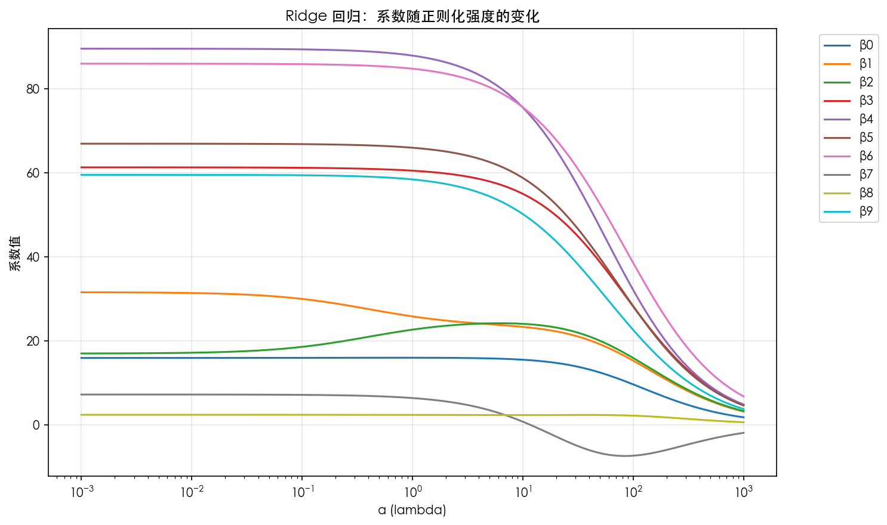
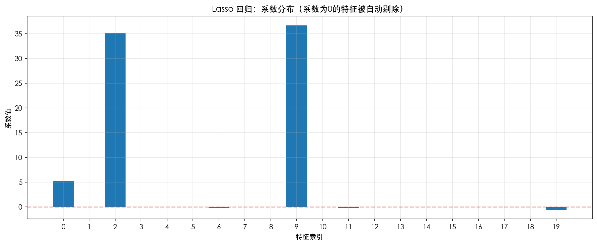
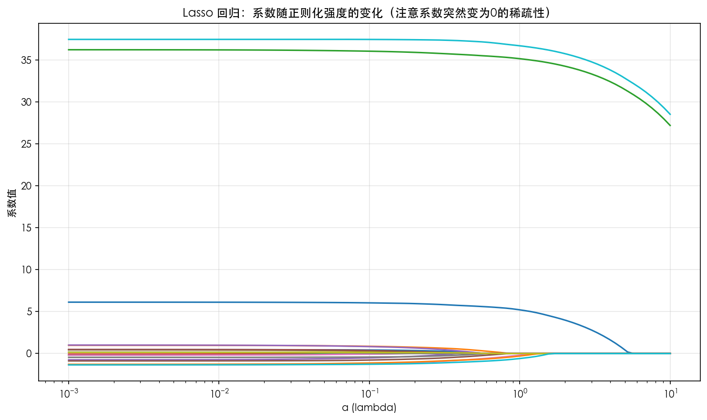
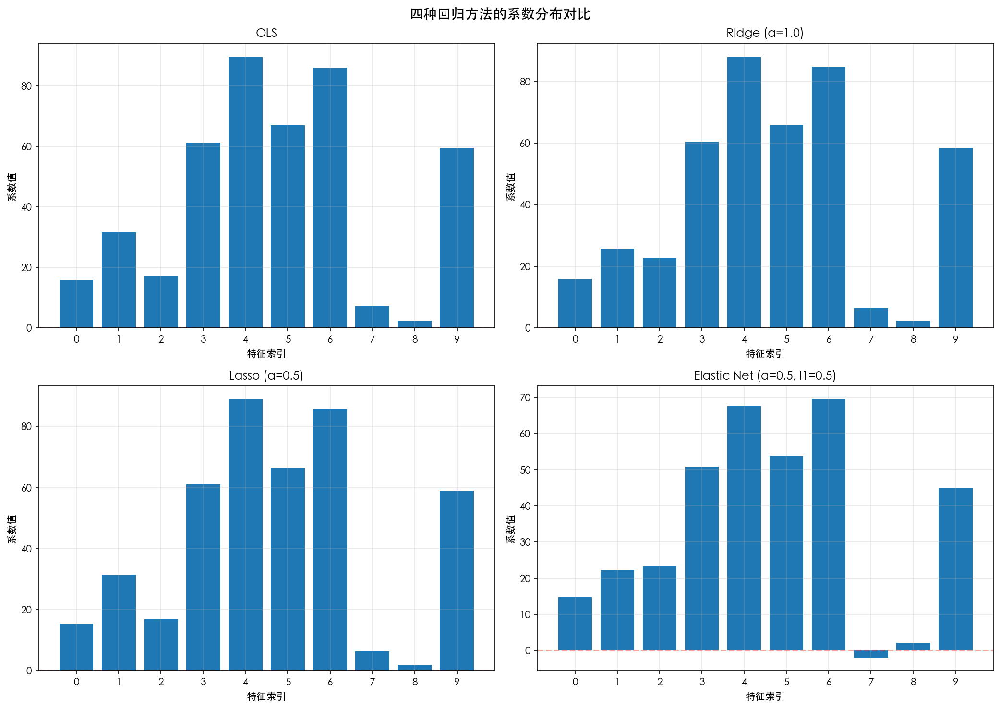
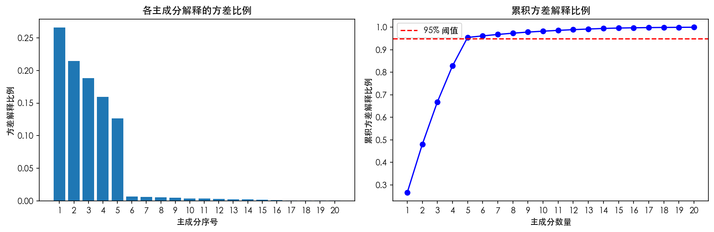
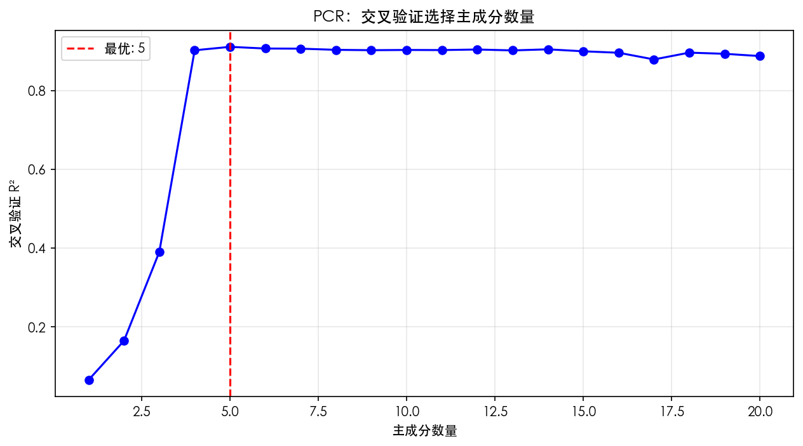
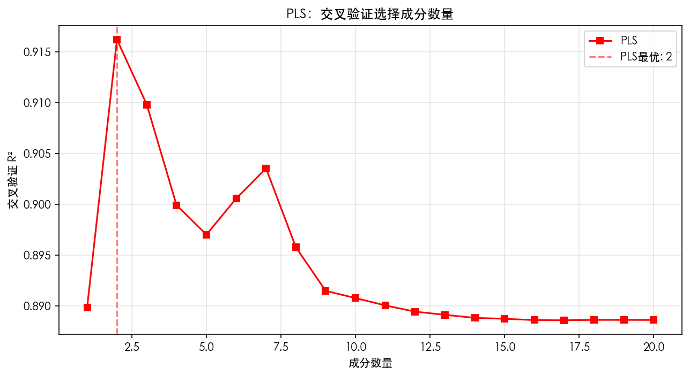
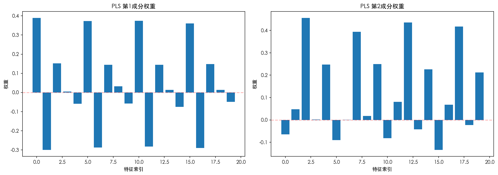

# 回归分析中的正则化与降维

***

## 1. 先回答一个问题：为什么要正则化？

### 1.1 过拟合

模型过于复杂时，不仅学习数据规律，还会学习噪声。训练集表现优异，但对新数据的泛化能力差。

常见现象：用一条高度非线性的曲线拟合所有训练点，训练集表现完美，但对新数据的预测能力很差。

### 1.2 多重共线性

特征之间高度相关时，OLS 的系数估计会变得非常不稳定。方差膨胀因子（VIF）飙高，模型对数据的小扰动极度敏感。

比如预测客户是否购买理财产品，"月收入"和"月存款额"基本是一回事。OLS 可能给收入一个很大的正系数，给存款额一个很大的负系数，两者互相抵消。数据稍有变化，系数估计就会大幅波动。

### 1.3 系数膨胀

OLS 为了把残差平方和压到最小，有些系数会被估计得非常大。这不仅让模型在新数据上表现差，而且根本没法解释——一个特征怎么能有那么大的影响力？

### 1.4 正则化到底在干什么

**【核心概念】** 正则化的基本思想

在损失函数中增加惩罚项，限制系数增长。本质是在"拟合训练数据"与"控制模型复杂度"之间寻求平衡。

**【重要公式】** 正则化的一般形式

$$
\text{正则化损失} = \text{原始损失} + \lambda \times \text{惩罚项}
$$

λ 值越大，惩罚力度越强，模型越保守。

**【重要说明】** 公式符号与 scikit-learn 参数的对应关系

在阅读后续公式时，请注意以下对应关系：

| 公式符号       | scikit-learn 参数 | 含义                           | 适用范围                   |
| ---------- | --------------- | ---------------------------- | ---------------------- |
| λ (lambda) | `alpha`         | 正则化强度（惩罚系数）                  | Ridge、Lasso、ElasticNet |
| α (alpha)  | `l1_ratio`      | L1 惩罚比例（0=纯 Ridge，1=纯 Lasso） | 仅 ElasticNet           |

**为什么代码中叫** **`alpha`** **而公式中叫 λ？**

这是一个历史惯例：数学公式通常用 λ 表示正则化强度，但 scikit-learn 统一使用 `alpha` 作为参数名。在 ElasticNet 中，公式有两个符号（λ 和 α），代码则用 `alpha`（对应 λ）和 `l1_ratio`（对应 α）。

**重要提醒：**

- Ridge 和 Lasso 公式中只有 λ，对应代码中的 `alpha` 参数
- ElasticNet 公式中有 λ 和 α，分别对应代码中的 `alpha` 和 `l1_ratio` 参数

***

## 2. L2 正则化：Ridge 回归

### 2.1 原理

**【重要公式】** Ridge 回归的损失函数

Ridge 的做法是在损失函数里加上所有系数的平方和：

$$
L = \sum\_{i=1}^{n} (y\_i - \hat{y}_i)^2 + \lambda \sum_{j=1}^{p} \beta\_j^2
$$

第一项是残差平方和，第二项就是 L2 惩罚。

**【符号速查】** ∑\_{i=1}^{n} 的含义

∑（sigma）是求和符号：
- **∑\_{i=1}^{n} (y\_i - ŷ\_i)²** = (y₁-ŷ₁)² + (y₂-ŷ₂)² + ... + (yₙ-ŷₙ)²，即所有样本的残差平方和
- **∑\_{j=1}^{p} β\_j²** = β₁² + β₂² + ... + βₚ²，即所有特征系数的平方和

### 2.2 特点

**【核心概念】** Ridge 回归的特性

- 所有系数一起往 0 靠，但一般不会真的变成 0
- 不进行特征选择，所有特征都留着
- 对高度相关的特征会给相近的系数，共线性问题能缓解
- 损失函数是凸的，有解析解，算起来快

### 2.3 几何上的直觉

**【难点解析】** L2 约束的几何解释

L2 惩罚的约束边界是一个圆。损失函数的等高线是椭圆。椭圆和圆的交点通常不会落在坐标轴上，所以所有系数都会被压缩，但很少被压到 0。

**直观类比**：想象你在一个圆形围栏（L2约束）内寻找最低点（最小损失）。围栏是圆的，所以边缘是平滑的，你通常会在围栏的侧边某处停下，而不是正好停在坐标轴上。这意味着所有特征都保留，但影响力被均匀压缩。

### 2.4 什么时候用

**【实践要点】** Ridge 的适用场景

特征数量适中，每个特征都可能有点用；特征之间相关性高；主要做预测，不太关心特征筛选；甚至特征数比样本数还多的时候，Ridge 也还能算。

### 2.5 Python 代码

```python
import numpy as np
import matplotlib.pyplot as plt
from sklearn.linear_model import Ridge
from sklearn.model_selection import train_test_split
from sklearn.preprocessing import StandardScaler
from sklearn.datasets import make_regression

np.random.seed(42)
X, y = make_regression(n_samples=100, n_features=10, noise=10, random_state=42)

# 人为制造共线性：比如"信用卡月均消费"和"储蓄账户月均流入"高度相关
X[:, 2] = X[:, 1] + np.random.normal(0, 0.1, size=100)

X_train, X_test, y_train, y_test = train_test_split(X, y, test_size=0.3, random_state=42)

scaler = StandardScaler()
X_train_scaled = scaler.fit_transform(X_train)
X_test_scaled = scaler.transform(X_test)

ridge = Ridge(alpha=1.0)
ridge.fit(X_train_scaled, y_train)

print("Ridge 回归系数:")
for i, coef in enumerate(ridge.coef_):
    print(f"  β{i}: {coef:.4f}")

print(f"\n训练集 R²: {ridge.score(X_train_scaled, y_train):.4f}")
print(f"测试集 R²: {ridge.score(X_test_scaled, y_test):.4f}")
```

**运行结果：**

```
Ridge 回归系数:
  β0: 15.9757
  β1: 25.8192
  β2: 22.6665
  β3: 60.5244
  β4: 87.9316
  β5: 65.9890
  β6: 84.8102
  β7: 6.3733
  β8: 2.3555
  β9: 58.4408

训练集 R²: 0.9968
测试集 R²: 0.9960
```

### 2.6 看看 λ 怎么影响系数

```python
alphas = np.logspace(-3, 3, 100)
coefs = []

for alpha in alphas:
    ridge = Ridge(alpha=alpha)
    ridge.fit(X_train_scaled, y_train)
    coefs.append(ridge.coef_)

coefs = np.array(coefs)

plt.figure(figsize=(10, 6))
for i in range(10):
    plt.plot(alphas, coefs[:, i], label=f'β{i}')
plt.xscale('log')
plt.xlabel('α (lambda)')
plt.ylabel('系数值')
plt.title('Ridge 回归：系数随正则化强度的变化')
plt.legend(bbox_to_anchor=(1.05, 1), loc='upper left')
plt.grid(True, alpha=0.3)
plt.tight_layout()
plt.show()
```



α 越大，系数越平滑地向 0 靠拢，但没有哪个系数真正归零。

#### 如何从系数路径图选择 alpha？

**【实践要点】** 解读系数路径图

系数路径图展示了 alpha 从极小值到极大值变化时，各个系数的变化趋势。通过观察这张图，可以：

1. **识别关键转折点**：找到系数开始显著收缩的 alpha 值
2. **判断模型稳定性**：如果系数随 alpha 剧烈波动，说明模型不稳定
3. **直观理解正则化效果**：看到不同特征被"压缩"的速度

**选择 alpha 的启发式方法：**

```python
# 方法：找到系数变化最平缓的区域
coefs_array = np.array(coefs)
coef_changes = np.abs(np.diff(coefs_array, axis=0)).mean(axis=1)

# 系数变化最小的区域通常对应最佳 alpha 范围
stable_region_start = np.argmin(coef_changes[:50])  # 前半部分
stable_region_end = 50 + np.argmin(coef_changes[50:])  # 后半部分

best_alpha_range = (alphas[stable_region_start], alphas[stable_region_end])
print(f"系数稳定的 alpha 范围: {best_alpha_range[0]:.4f} - {best_alpha_range[1]:.4f}")
```

**实际建议**：

- 不要选择系数已经开始"塌陷"的 alpha（图右侧）
- 也不要选择系数仍然"膨胀"的 alpha（图左侧）
- 最佳 alpha 通常在中间区域，系数大小适中且变化平缓

***

## 3. L1 正则化：Lasso 回归

### 3.1 原理

**【重要公式】** Lasso 回归的损失函数

Lasso 加的是系数绝对值之和：

$$
L = \sum\_{i=1}^{n} (y\_i - \hat{y}_i)^2 + \lambda \sum_{j=1}^{p} |\beta\_j|
$$

**【符号说明】** 公式含义

与 Ridge 类似，但惩罚项不同：

- **∑\_{i=1}^{n}**：对 n 个样本点的残差平方求和
- **∑\_{j=1}^{p}**：对 p 个特征的系数绝对值求和
- **λ**：正则化强度（代码中的 `alpha`）
- **|β\_j|**：系数 β\_j 的绝对值

### 3.2 特点

**【核心概念】** Lasso 的稀疏性

- 能把不重要特征的系数精确压到 0
- 自动做特征选择
- 特征高度相关时，Lasso 倾向于只挑其中一个，结果不太稳定
- 绝对值在 0 点不可导，需要用坐标下降这类算法

### 3.3 几何直觉

**【难点解析】** L1 约束的几何解释

L1 惩罚的约束边界是菱形，顶点正好落在坐标轴上。损失函数的等高线和菱形交在顶点上的概率不小，交在顶点就意味着某些系数为 0。sparse 解就是这么来的。

**直观类比**：想象你在一个菱形围栏（L1约束）内寻找最低点。菱形的四个角正好在坐标轴上。当损失函数的等高线（椭圆）向外扩展时，有很大概率先碰到菱形的某个顶点而不是边。一旦碰到顶点，就意味着某个特征的系数恰好为0——该特征被自动剔除。

### 3.4 什么时候用

**【实践要点】** Lasso 的适用场景

适用于以下场景：特征数量多，但仅部分特征真正重要；需要可解释的模型；维度特别高（如客户画像包含数千个行为指标）；或需减少存储与计算成本。

### 3.5 Python 代码

```python
from sklearn.linear_model import Lasso

lasso = Lasso(alpha=0.5)
lasso.fit(X_train_scaled, y_train)

print("Lasso 回归系数:")
for i, coef in enumerate(lasso.coef_):
    status = "保留" if coef != 0 else "剔除"
    print(f"  β{i}: {coef:.4f} ({status})")

print(f"\n非零系数个数: {np.sum(lasso.coef_ != 0)}")
print(f"训练集 R²: {lasso.score(X_train_scaled, y_train):.4f}")
print(f"测试集 R²: {lasso.score(X_test_scaled, y_test):.4f}")
```

**运行结果：**

```
Lasso 回归系数:
  β0: 15.4125 (保留)
  β1: 31.4757 (保留)
  β2: 16.7987 (保留)
  β3: 60.9763 (保留)
  β4: 88.8094 (保留)
  β5: 66.3256 (保留)
  β6: 85.5253 (保留)
  β7: 6.3336 (保留)
  β8: 1.8584 (保留)
  β9: 58.9449 (保留)

非零系数个数: 10
训练集 R²: 0.9970
测试集 R²: 0.9963
```

### 3.6 特征选择的例子

```python
# 只有 3 个特征真正相关
X_sparse, y_sparse = make_regression(
    n_samples=100, n_features=20, n_informative=3,
    noise=10, random_state=42
)

X_train_s, X_test_s, y_train_s, y_test_s = train_test_split(
    X_sparse, y_sparse, test_size=0.3, random_state=42
)

scaler_s = StandardScaler()
X_train_s = scaler_s.fit_transform(X_train_s)
X_test_s = scaler_s.transform(X_test_s)

lasso_fs = Lasso(alpha=1.0)
lasso_fs.fit(X_train_s, y_train_s)

selected_features = np.where(lasso_fs.coef_ != 0)[0]
print(f"Lasso 选择的特征索引: {selected_features}")
print(f"选择的特征数量: {len(selected_features)} / 20")

plt.figure(figsize=(12, 5))
plt.bar(range(20), lasso_fs.coef_)
plt.xlabel('特征索引')
plt.ylabel('系数值')
plt.title('Lasso 回归：系数分布（系数为0的特征被自动剔除）')
plt.axhline(y=0, color='r', linestyle='--', alpha=0.3)
plt.xticks(range(20))
plt.grid(True, alpha=0.3)
plt.show()
```

**运行结果：**

```
Lasso 选择的特征索引: [ 0  2  6  9 11 19]
选择的特征数量: 6 / 20
```



### 3.7 系数路径

```python
alphas_lasso = np.logspace(-3, 1, 100)
coefs_lasso = []

for alpha in alphas_lasso:
    lasso = Lasso(alpha=alpha, max_iter=10000)
    lasso.fit(X_train_s, y_train_s)
    coefs_lasso.append(lasso.coef_)

coefs_lasso = np.array(coefs_lasso)

plt.figure(figsize=(10, 6))
for i in range(20):
    plt.plot(alphas_lasso, coefs_lasso[:, i], label=f'β{i}')
plt.xscale('log')
plt.xlabel('α (lambda)')
plt.ylabel('系数值')
plt.title('Lasso 回归：系数随正则化强度的变化（注意系数突然变为0的稀疏性）')
plt.grid(True, alpha=0.3)
plt.tight_layout()
plt.show()
```



跟 Ridge 不一样，Lasso 的系数会突然跳到 0。

#### Lasso 系数路径图的解读与 alpha 选择

**【核心概念】** Lasso 系数路径图的关键特征

Lasso 的系数路径图与 Ridge 有本质区别：

1. **稀疏性**：系数会精确变为 0（而非接近 0）
2. **特征选择**：每个系数"归零"的 alpha 值不同，实现了特征选择
3. **稳定性**：一旦归零，系数将保持为 0

**如何选择 Lasso 的 alpha？**

```python
# 分析每个特征"归零"的 alpha 值
zero_threshold = 1e-6  # 系数绝对值小于此值视为 0

feature_death_alphas = []
for feature_idx in range(coefs_lasso.shape[1]):
    # 找到该特征系数首次归零的位置
    coefs_feature = np.abs(coefs_lasso[:, feature_idx])
    zero_positions = np.where(coefs_feature < zero_threshold)[0]
    if len(zero_positions) > 0:
        death_alpha = alphas_lasso[zero_positions[0]]
        feature_death_alphas.append((feature_idx, death_alpha))
    else:
        feature_death_alphas.append((feature_idx, float('inf')))

# 按 alpha 排序，了解特征重要性
sorted_features = sorted(feature_death_alphas, key=lambda x: x[1])

print("特征重要性（按归零 alpha 排序，越晚归零越重要）：")
for feat_idx, death_alpha in sorted_features[:10]:
    if death_alpha == float('inf'):
        print(f"  特征 {feat_idx}: 始终保留")
    else:
        print(f"  特征 {feat_idx}: alpha = {death_alpha:.4f} 时归零")
```

**选择 alpha 的启发式方法：**

1. **肘部法则**：观察特征数量随 alpha 变化的曲线，找到"肘部"
2. **业务需求**：根据需要保留的特征数量反推 alpha
3. **交叉验证**：在稀疏性约束下最大化预测性能

**实际建议：**

- 选择 alpha 使得重要特征刚好保留，噪声特征被剔除
- 如果特征数量变化太剧烈（多个特征同时归零），可能 alpha 范围设置不当
- 结合领域知识判断：某些特征即使系数小也可能重要

***

## 4. 弹性网（Elastic Net）

### 4.1 原理

**【重要公式】** Elastic Net 的损失函数

Elastic Net 把 L1 和 L2 揉在一起：

$$
L = \sum\_{i=1}^{n} (y\_i - \hat{y}_i)^2 + \lambda \left\[ \alpha \sum_{j=1}^{p} |\beta\_j| + (1-\alpha) \sum\_{j=1}^{p} \beta\_j^2 \right]
$$

α = 1 是纯 Lasso，α = 0 是纯 Ridge，中间值就是混合。

**【重要符号说明】** ElasticNet 公式符号与代码参数的对应

这个公式包含两个符号，需要特别注意：

| 公式符号       | scikit-learn 参数 | 含义          | 取值范围          |
| ---------- | --------------- | ----------- | ------------- |
| λ (lambda) | `alpha`         | 正则化强度（惩罚系数） | 通常 0.001 - 10 |
| α (alpha)  | `l1_ratio`      | L1 惩罚比例     | 0 到 1 之间      |

**具体对应关系：**

- **λ (lambda)**：控制整体惩罚强度，λ 越大，模型越保守
- **α (alpha)**：控制 L1 和 L2 的混合比例
  - α = 1 → 纯 Lasso（只有 L1 惩罚）
  - α = 0 → 纯 Ridge（只有 L2 惩罚）
  - 0 < α < 1 → Elastic Net（混合惩罚）

**代码示例：**

```python
# 公式中的 λ 对应代码中的 alpha 参数
# 公式中的 α 对应代码中的 l1_ratio 参数
elastic = ElasticNet(alpha=0.5, l1_ratio=0.7)
# 这里：
#   alpha=0.5 对应公式中的 λ=0.5
#   l1_ratio=0.7 对应公式中的 α=0.7
```

### 4.2 特点

**【核心概念】** Elastic Net 的优势

- 既有 Lasso 的特征选择能力，又有 Ridge 的稳定性
- 面对一组相关特征时，Elastic Net 可能把整组都选进来，而不是像 Lasso 那样只挑一个
- 通过调 α 可以在 Ridge 和 Lasso 之间过渡
- 缺点是得同时调 λ 和 α，麻烦一点

### 4.3 为什么需要它

Lasso 有个问题：当特征数远大于样本数时，它最多只能选 n 个特征；而且遇到相关特征组，它倾向于只选一个。

Elastic Net 用 L2 让相关特征的系数趋于相近，再用 L1 保证稀疏性，结果是一组相关特征里的多个特征可能被同时选中。

### 4.4 什么时候用

特征数远大于样本数；特征有明显的"组"结构；Lasso 的结果太稀疏或者不稳定；拿不准该用 Ridge 还是 Lasso 的时候，Elastic Net 通常是个稳妥的选择。

### 4.5 Python 代码

```python
from sklearn.linear_model import ElasticNet

elastic = ElasticNet(alpha=0.5, l1_ratio=0.5)
elastic.fit(X_train_scaled, y_train)

print("Elastic Net 系数:")
for i, coef in enumerate(elastic.coef_):
    status = "保留" if coef != 0 else "剔除"
    print(f"  β{i}: {coef:.4f} ({status})")

print(f"\n非零系数个数: {np.sum(elastic.coef_ != 0)}")
print(f"训练集 R²: {elastic.score(X_train_scaled, y_train):.4f}")
print(f"测试集 R²: {elastic.score(X_test_scaled, y_test):.4f}")
```

**运行结果：**

```
Elastic Net 系数:
  β0: 14.7632 (保留)
  β1: 22.3957 (保留)
  β2: 23.2954 (保留)
  β3: 50.8747 (保留)
  β4: 67.5299 (保留)
  β5: 53.6772 (保留)
  β6: 69.5431 (保留)
  β7: -1.9490 (保留)
  β8: 2.1283 (保留)
  β9: 44.9921 (保留)

非零系数个数: 10
训练集 R²: 0.9597
测试集 R²: 0.9526
```

### 4.6 组效应的例子

```python
np.random.seed(42)
n_samples = 100
X_group = np.random.randn(n_samples, 8)

# 特征 0,1,2 高度相关
X_group[:, 1] = X_group[:, 0] + np.random.normal(0, 0.1, n_samples)
X_group[:, 2] = X_group[:, 0] + np.random.normal(0, 0.1, n_samples)

y_group = 3 * X_group[:, 0] + 3 * X_group[:, 1] + 3 * X_group[:, 2] + np.random.normal(0, 1, n_samples)

X_train_g, X_test_g, y_train_g, y_test_g = train_test_split(
    X_group, y_group, test_size=0.3, random_state=42
)

scaler_g = StandardScaler()
X_train_g = scaler_g.fit_transform(X_train_g)
X_test_g = scaler_g.transform(X_test_g)

lasso_g = Lasso(alpha=0.3)
elastic_g = ElasticNet(alpha=0.3, l1_ratio=0.5)

lasso_g.fit(X_train_g, y_train_g)
elastic_g.fit(X_train_g, y_train_g)

print("组效应数据对比：")
print(f"{'特征':>8} {'真实影响':>10} {'Lasso':>10} {'ElasticNet':>12}")
print("-" * 45)
for i in range(8):
    true_effect = "重要" if i < 3 else "无"
    print(f"{i:>8} {true_effect:>10} {lasso_g.coef_[i]:>10.4f} {elastic_g.coef_[i]:>12.4f}")
```

**运行结果：**

```
组效应数据对比：
      特征       真实影响      Lasso   ElasticNet
---------------------------------------------
       0         重要     4.6600       2.3022
       1         重要     1.5166       2.2718
       2         重要     0.7844       2.2036
       3          无    -0.0000       0.0000
       4          无     0.0000       0.0000
       5          无     0.0000       0.0000
       6          无    -0.0000      -0.0000
       7          无     0.0000       0.0000
```

Lasso 可能只选中组里的一个特征，Elastic Net 更可能多选几个相关的。

### 4.7 调 α 参数

```python
l1_ratios = np.linspace(0.1, 0.9, 9)
results = []

for l1_ratio in l1_ratios:
    elastic = ElasticNet(alpha=0.5, l1_ratio=l1_ratio, max_iter=10000)
    elastic.fit(X_train_scaled, y_train)
    results.append({
        'l1_ratio': l1_ratio,
        'nonzero': np.sum(elastic.coef_ != 0),
        'train_r2': elastic.score(X_train_scaled, y_train),
        'test_r2': elastic.score(X_test_scaled, y_test)
    })

print(f"{'l1_ratio':>10} {'非零系数':>10} {'训练R²':>10} {'测试R²':>10}")
print("-" * 45)
for r in results:
    print(f"{r['l1_ratio']:>10.1f} {r['nonzero']:>10} {r['train_r2']:>10.4f} {r['test_r2']:>10.4f}")
```

**运行结果：**

```
  l1_ratio       非零系数       训练R²       测试R²
---------------------------------------------
       0.1         10     0.9108     0.9011
       0.2         10     0.9234     0.9143
       0.3         10     0.9359     0.9273
       0.4         10     0.9481     0.9402
       0.5         10     0.9597     0.9526
       0.6         10     0.9706     0.9645
       0.7         10     0.9801     0.9750
       0.8         10     0.9883     0.9845
       0.9         10     0.9942     0.9919
```

***

## 5. 三种正则化方法对比

```python
from sklearn.linear_model import LinearRegression

models = {
    'OLS': LinearRegression(),
    'Ridge (L2)': Ridge(alpha=1.0),
    'Lasso (L1)': Lasso(alpha=0.5),
    'Elastic Net': ElasticNet(alpha=0.5, l1_ratio=0.5)
}

print(f"{'模型':>15} {'非零系数':>10} {'训练R²':>10} {'测试R²':>10}")
print("-" * 50)
for name, model in models.items():
    model.fit(X_train_scaled, y_train)
    nonzero = np.sum(model.coef_ != 0)
    train_r2 = model.score(X_train_scaled, y_train)
    test_r2 = model.score(X_test_scaled, y_test)
    print(f"{name:>15} {nonzero:>10} {train_r2:>10.4f} {test_r2:>10.4f}")
```

**运行结果：**

```
             模型       非零系数       训练R²       测试R²
--------------------------------------------------
            OLS         10     0.9970     0.9967
     Ridge (L2)         10     0.9968     0.9960
     Lasso (L1)         10     0.9970     0.9963
    Elastic Net         10     0.9597     0.9526
```

### 5.1 差异一览

**【核心概念】** 四种回归方法的对比

| 特性    | OLS    | Ridge (L2)        | Lasso (L1)                  | Elastic Net                                                     |
| ----- | ------ | ----------------- | --------------------------- | --------------------------------------------------------------- |
| 惩罚项   | 无      | $\sum \beta\_j^2$ | $\sum \lvert\beta\_j\rvert$ | $\alpha \sum \lvert\beta\_j\rvert + (1-\alpha) \sum \beta\_j^2$ |
| 稀疏性   | 否      | 否                 | 是                           | 是                                                               |
| 特征选择  | 无      | 无                 | 自动                          | 自动                                                              |
| 共线性处理 | 差      | 好                 | 一般                          | 好                                                               |
| 相关特征  | 不稳定    | 系数相近              | 只选一个                        | 同时选中组内特征                                                        |
| 计算复杂度 | 低      | 低                 | 中等                          | 中等                                                              |
| 超参数   | 0      | 1 (λ)             | 1 (λ)                       | 2 (λ, α)                                                        |
| 适用场景  | 低维、无共线 | 预测为主、共线严重         | 特征筛选、高维稀疏                   | 综合场景、p>>n                                                       |

### 5.2 系数分布可视化

```python
fig, axes = plt.subplots(2, 2, figsize=(14, 10))
models_list = [
    ('OLS', LinearRegression()),
    ('Ridge (α=1.0)', Ridge(alpha=1.0)),
    ('Lasso (α=0.5)', Lasso(alpha=0.5)),
    ('Elastic Net (α=0.5, l1=0.5)', ElasticNet(alpha=0.5, l1_ratio=0.5))
]

for ax, (name, model) in zip(axes.flat, models_list):
    model.fit(X_train_scaled, y_train)
    ax.bar(range(10), model.coef_)
    ax.set_title(name)
    ax.set_xlabel('特征索引')
    ax.set_ylabel('系数值')
    ax.axhline(y=0, color='r', linestyle='--', alpha=0.3)
    ax.set_xticks(range(10))
    ax.grid(True, alpha=0.3)

plt.suptitle('四种回归方法的系数分布对比', fontsize=14)
plt.tight_layout()
plt.show()
```



***

## 6. 实际操作建议

### 6.1 怎么选方法

- 特征数 p 远大于样本数 n？优先 Lasso 或 Elastic Net
- 特征之间相关性很强？Ridge 或 Elastic Net
- 需要可解释性，想知道哪些特征重要？Lasso 或 Elastic Net
- 纯预测，不关心特征重要性？Ridge
- 两者都要？Elastic Net

### 6.2 超参数调优

用交叉验证选正则化强度：

```python
from sklearn.linear_model import RidgeCV, LassoCV, ElasticNetCV

ridge_cv = RidgeCV(alphas=np.logspace(-3, 3, 100), cv=5)
ridge_cv.fit(X_train_scaled, y_train)
print(f"Ridge 最优 alpha: {ridge_cv.alpha_:.4f}")

lasso_cv = LassoCV(alphas=np.logspace(-3, 1, 100), cv=5, max_iter=10000)
lasso_cv.fit(X_train_scaled, y_train)
print(f"Lasso 最优 alpha: {lasso_cv.alpha_:.4f}")

elastic_cv = ElasticNetCV(
    l1_ratio=[0.1, 0.3, 0.5, 0.7, 0.9],
    alphas=np.logspace(-3, 1, 50),
    cv=5, max_iter=10000
)
elastic_cv.fit(X_train_scaled, y_train)
print(f"Elastic Net 最优 alpha: {elastic_cv.alpha_:.4f}, l1_ratio: {elastic_cv.l1_ratio_:.1f}")
```

**运行结果：**

```
Ridge 最优 alpha: 0.4037
Lasso 最优 alpha: 0.3854
Elastic Net 最优 alpha: 0.0139, l1_ratio: 0.5
```

### 6.2.1 alpha（λ）选择的实践要点

**【核心概念】** alpha 控制"拟合训练数据"与"控制模型复杂度"之间的平衡。

| alpha 值   | 效果           | 风险           |
| --------- | ------------ | ------------ |
| alpha = 0 | 退化为 OLS，无正则化 | 过拟合，系数膨胀     |
| alpha 较小  | 轻微收缩，保留大部分信号 | 可能仍有过拟合风险    |
| alpha 适中  | 最佳平衡点        | 需要交叉验证确定     |
| alpha 较大  | 强收缩，模型简单     | 可能欠拟合，丢失重要信号 |
| alpha → ∞ | 所有系数压到 0     | 模型完全失效       |

**alpha 的数学直觉**：alpha 小则拟合优度主导（可能过拟合），alpha 大则复杂度惩罚主导（可能欠拟合）。

**搜索范围建议（使用对数尺度）：**

- Ridge：`np.logspace(-3, 3, 100)` — L2 温和，需要大范围
- Lasso：`np.logspace(-3, 1, 100)` — L1 激进，过大则所有系数归零
- Elastic Net：`np.logspace(-3, 1, 50)` + `l1_ratio=[0.1, 0.5, 0.7, 0.9]`

**三个常见误区：**

1. **只看训练集表现** — alpha 太小会导致过拟合，训练集 R² 高但测试集低
2. **范围设置太窄** — 避免只试 `[0.1, 1, 10]`，应用对数尺度宽范围搜索
3. **忽略数据标准化** — 特征尺度不同时，正则化会不公平地惩罚小尺度特征

```python
# 正确流程：先标准化，再调参
scaler = StandardScaler()
X_train_scaled = scaler.fit_transform(X_train)
X_test_scaled = scaler.transform(X_test)

ridge_cv = RidgeCV(alphas=np.logspace(-3, 3, 100), cv=5)
ridge_cv.fit(X_train_scaled, y_train)
```

**alpha 选择策略：**

1. **从宽到窄**：先粗搜索 `np.logspace(-4, 4, 20)`，再在最优值附近细搜索
2. **验证曲线**：用 `validation_curve` 可视化训练/验证得分，找峰值
3. **业务调整**：需稀疏模型则增大 Lasso alpha；需稳定预测则选适中值

**不同方法的 alpha 特性：**

| 方法          | alpha 敏感度 | 典型范围        | 注意事项           |
| ----------- | --------- | ----------- | -------------- |
| Ridge       | 中等        | 0.001 - 100 | 过大仍能计算，但系数过小   |
| Lasso       | 高         | 0.001 - 10  | 过大使所有系数为 0     |
| Elastic Net | 高         | 0.001 - 10  | 需同时调 l1\_ratio |

**自动化最佳实践：**

```python
from sklearn.pipeline import Pipeline

pipe = Pipeline([
    ('scaler', StandardScaler()),
    ('ridge', RidgeCV(alphas=np.logspace(-3, 3, 100), cv=5))
])
pipe.fit(X_train, y_train)
best_alpha = pipe.named_steps['ridge'].alpha_
```

### 6.3 注意点

- 必须标准化。正则化对特征尺度很敏感，用 StandardScaler 标准化成零均值单位方差。
- 截距项默认不惩罚，不用管。
- λ 太小接近 OLS，可能过拟合；λ 太大所有系数压到 0，模型欠拟合。交叉验证来定。

***

## 7. 正则化小结

**【核心概念】** 三种正则化方法的总结

| 方法          | 一句话                    |
| ----------- | ---------------------- |
| Ridge (L2)  | 所有特征都变小，一个不扔，适合共线性强的场景 |
| Lasso (L1)  | 不重要的特征系数归零，适合高维特征筛选    |
| Elastic Net | 两者结合，还能处理相关特征组，最通用     |

**【关键洞察】** 正则化的核心

理解 L1 和 L2 的几何差异是掌握正则化的关键。L2 约束为圆形，L1 约束为菱形，交点位置直接决定系数是否能被压缩至 0。

***

## 8. 降维：另一条路

正则化是通过惩罚系数大小来控制复杂度，降维则是直接减少特征数量。思路不同，但目标一样。

### 8.1 为什么降维

**维度灾难**

当特征维度 p 接近甚至超过样本量 n，OLS 的解不唯一，协方差矩阵不可逆。高维空间里数据极度稀疏，距离失效，模型学不到稳定的东西。

**共线性的另一种解法**

与其像 Ridge 那样保留所有特征但缩小系数，不如直接扔掉冗余信息，用少数几个不相关的新特征替代原始特征。

**计算效率**

特征少了，训练、预测、存储都更快。

**滤噪声**

原始特征里有不少跟目标无关的噪声。降维能提取信号、丢掉噪声。

**可视化**

降到 2 维或 3 维可以直接画图看数据结构。

核心思想：把 p 个相关特征转换成 m 个（m 远小于 p）不相关的新特征，然后在新特征上做回归。

***

## 9. 主成分回归（PCR）

### 9.1 原理

**【核心概念】** PCR 的两步流程

PCR 分两步：

1. 对 X 做 PCA，提取前 m 个主成分
2. 用这 m 个主成分替代原始特征，对 y 做 OLS

**【重要公式】** PCR 的流程表示

```
X (n×p)  --PCA-->  Z (n×m)  --OLS-->  ŷ
```

### 9.2 PCA 在做什么

**【核心概念】** 主成分的含义

PCA 找数据方差最大的方向。第一主成分是方差最大的方向，第二主成分是在跟第一主成分正交的条件下方差次大的方向，以此类推。这些主成分是原始特征的线性组合，彼此互不相关。

### 9.3 PCR 的特点

**【难点解析】** PCR 的局限性

- PCA 只看 X 的方差结构，完全不考虑 y（无监督降维）
- 主成分之间两两正交，共线性被根除
- 被丢弃的主成分可能恰好包含对预测客户购买行为有用的信息，这是风险
- 需要选保留多少个主成分，通常用交叉验证

### 9.4 一个直观的例子

预测客户信贷违约概率，特征有"月均消费额"和"月均还款额"，两者高度相关（消费多通常还款也多）。

PCA 会提取一个主成分代表"资金流动规模"，另一个代表"还款能力比例"。PCR 用资金流动规模预测违约，可能发现它跟违约关系不大。但问题是 PCA 提取主成分时根本没看违约标签，也许还款能力比例反而和违约率高度相关，却被第一个主成分的筛选逻辑给埋没了。

因此，PCR 的核心问题在于：主成分方向可能与预测目标无关。

### 9.5 Python 代码

```python
import numpy as np
import matplotlib.pyplot as plt
from sklearn.decomposition import PCA
from sklearn.linear_model import LinearRegression
from sklearn.model_selection import train_test_split, cross_val_score
from sklearn.preprocessing import StandardScaler
from sklearn.pipeline import make_pipeline

np.random.seed(42)
n_samples, n_features = 100, 20

X_base = np.random.randn(n_samples, 5)

X = np.zeros((n_samples, n_features))
X[:, :5] = X_base
for i in range(5, 20):
    X[:, i] = X_base[:, i % 5] + np.random.normal(0, 0.3, n_samples)

true_coef = np.array([3, -2, 1.5, 0, 0])
y = X_base @ true_coef + np.random.normal(0, 1, n_samples)

X_train, X_test, y_train, y_test = train_test_split(X, y, test_size=0.3, random_state=42)

# PCA 降维
pca = PCA()
X_train_pca = pca.fit_transform(X_train)
X_test_pca = pca.transform(X_test)

# 看方差解释比例
plt.figure(figsize=(12, 4))

plt.subplot(1, 2, 1)
plt.bar(range(1, 21), pca.explained_variance_ratio_)
plt.xlabel('主成分序号')
plt.ylabel('方差解释比例')
plt.title('各主成分解释的方差比例')
plt.xticks(range(1, 21))

plt.subplot(1, 2, 2)
cumsum = np.cumsum(pca.explained_variance_ratio_)
plt.plot(range(1, 21), cumsum, 'bo-')
plt.axhline(y=0.95, color='r', linestyle='--', label='95% 阈值')
plt.xlabel('主成分数量')
plt.ylabel('累积方差解释比例')
plt.title('累积方差解释比例')
plt.legend()
plt.xticks(range(1, 21))

plt.tight_layout()
plt.show()

print("前5个主成分的方差解释比例:")
for i in range(5):
    print(f"  PC{i+1}: {pca.explained_variance_ratio_[i]:.4f}")

# 不同主成分数量做回归
print(f"\n{'主成分数':>10} {'训练R²':>10} {'测试R²':>10}")
print("-" * 35)

for n_components in [1, 2, 3, 5, 10, 20]:
    pcr = LinearRegression()
    pcr.fit(X_train_pca[:, :n_components], y_train)
    train_r2 = pcr.score(X_train_pca[:, :n_components], y_train)
    test_r2 = pcr.score(X_test_pca[:, :n_components], y_test)
    print(f"{n_components:>10} {train_r2:>10.4f} {test_r2:>10.4f}")
```

**运行结果：**

```
前5个主成分的方差解释比例:
  PC1: 0.2656
  PC2: 0.2147
  PC3: 0.1884
  PC4: 0.1597
  PC5: 0.1263

      主成分数       训练R²       测试R²
-----------------------------------
         1     0.0688     0.0889
         2     0.1941     0.0774
         3     0.3901     0.2994
         5     0.9394     0.9038
        10     0.9400     0.8987
        20     0.9608     0.8925
```



### 9.6 用 Pipeline 和交叉验证选主成分数

```python
from sklearn.pipeline import Pipeline

pcr_pipeline = Pipeline([
    ('scaler', StandardScaler()),
    ('pca', PCA()),
    ('regression', LinearRegression())
])

n_components_range = range(1, 21)
cv_scores = []

for n in n_components_range:
    pcr_pipeline.set_params(pca__n_components=n)
    scores = cross_val_score(pcr_pipeline, X_train, y_train, cv=5, scoring='r2')
    cv_scores.append(scores.mean())

best_n = list(n_components_range)[np.argmax(cv_scores)]
print(f"交叉验证选择的最优主成分数: {best_n}")

pcr_pipeline.set_params(pca__n_components=best_n)
pcr_pipeline.fit(X_train, y_train)
print(f"PCR 测试集 R²: {pcr_pipeline.score(X_test, y_test):.4f}")

plt.figure(figsize=(10, 5))
plt.plot(n_components_range, cv_scores, 'bo-')
plt.axvline(x=best_n, color='r', linestyle='--', label=f'最优: {best_n}')
plt.xlabel('主成分数量')
plt.ylabel('交叉验证 R²')
plt.title('PCR：交叉验证选择主成分数量')
plt.legend()
plt.grid(True, alpha=0.3)
plt.show()
```

**运行结果：**

```
交叉验证选择的最优主成分数: 5
PCR 测试集 R²: 0.9038
```



***

## 10. 偏最小二乘（PLS）

### 10.1 原理

**【核心概念】** PLS 与 PCR 的本质区别

PCR 的问题是 PCA 完全不看目标变量 y。它只关心 X 内部怎么"拉开差距"，不关心这些差距跟 y 有没有关系。

PLS 改进了这一点：提取成分时同时考虑 X 和 y 的相关性。

**【重要流程】** PLS 的算法步骤

1. 找 X 的一个线性组合，让它跟 y 的协方差最大
2. 从 X 中剔除该成分的影响（正交化）
3. 重复提取第二、第三...成分
4. 用提取的成分对 y 做回归

**【重要公式】** PLS 的流程表示

```
X, y  --PLS-->  T (n×m)  --OLS-->  ŷ
```

### 10.2 PLS 和 PCR 的区别

**【核心概念】** 两种降维方法的对比

| 维度     | PCR           | PLS             |
| ------ | ------------- | --------------- |
| 提取方向   | X 中方差最大的方向    | 与 y 协方差最大的方向    |
| 是否使用 y | 无监督           | 有监督             |
| 成分意义   | 代表 X 的主要变化模式  | 代表对预测客户行为最有用的信息 |
| 相同成分数时 | 可能包含与 y 无关的噪声 | 通常更聚焦于预测信号      |

### 10.3 直观理解

预测客户购买基金的概率，特征有"年收入"和"账户资产余额"。

PCA 提取的是财富差异最大的方向——资产总规模。但资产总规模对购买基金的预测力可能一般。

PLS 寻找的是收入和资产的某种组合，使其与购买基金的行为最相关。结果可能发现"收入/资产比"（即资金活跃度）恰好和基金购买率高度相关。

这就是两者最本质的差别。

### 10.4 PLS 的算法直觉

$$
\text{第1成分：} \\
\mathbf{w}\_1 = \mathbf{X}'\mathbf{y} \quad \text{（简单相关方向）} \\
\mathbf{t}\_1 = \mathbf{X}\mathbf{w}\_1 \quad \text{（成分得分）} \\
\text{从 } \mathbf{X} \text{ 中减去 } \mathbf{t}\_1 \text{ 的解释部分，得到残差 } \mathbf{X}\_1 \\
\text{第2成分：} \\
\mathbf{w}\_2 = \mathbf{X}\_1'\mathbf{y} \quad \text{（在残差中寻找新的相关方向）} \\
\mathbf{t}\_2 = \mathbf{X}\_1\mathbf{w}\_2 \\
\vdots
$$

每一轮都在还没被解释的 X 残差中，找跟 y 最相关的方向。

**更直观的理解**：

想象你要预测客户是否会购买基金，特征有"年收入"和"账户余额"。

- **PCR（PCA）的做法**：不管购买行为，只看收入和余额这两个特征怎么变化最大。可能发现"总资产规模"是变化最大的方向，但这跟购买基金的意愿关系不大。
- **PLS的做法**：直接找"什么样的收入和余额组合"最能区分"购买"和"不购买"的客户。可能发现"收入/余额比"（资金活跃度）恰好是关键——收入高但余额低的人可能更愿意买基金（有钱且愿意投资）。

这就是 PLS 的核心优势：提取成分时直接瞄准预测目标，而不是盲目追求方差最大。

### 10.5 Python 代码

```python
from sklearn.cross_decomposition import PLSRegression

print(f"{'成分数':>10} {'训练R²':>10} {'测试R²':>10}")
print("-" * 35)

for n_components in [1, 2, 3, 5, 10]:
    pls = PLSRegression(n_components=n_components)
    pls.fit(X_train, y_train)
    train_r2 = pls.score(X_train, y_train)
    test_r2 = pls.score(X_test, y_test)
    print(f"{n_components:>10} {train_r2:>10.4f} {test_r2:>10.4f}")
```

**运行结果：**

```
       成分数       训练R²       测试R²
-----------------------------------
         1     0.9254     0.8991
         2     0.9407     0.9037
         3     0.9416     0.9018
         5     0.9545     0.8834
        10     0.9608     0.8901
```

### 10.6 PLS 的交叉验证

```python
pls_cv_scores = []
for n in range(1, 21):
    pls = PLSRegression(n_components=n)
    scores = cross_val_score(pls, X_train, y_train, cv=5, scoring='r2')
    pls_cv_scores.append(scores.mean())

best_n_pls = range(1, 21)[np.argmax(pls_cv_scores)]
print(f"PLS 交叉验证最优成分数: {best_n_pls}")

pls_best = PLSRegression(n_components=best_n_pls)
pls_best.fit(X_train, y_train)
print(f"PLS 测试集 R²: {pls_best.score(X_test, y_test):.4f}")

plt.figure(figsize=(10, 5))
plt.plot(range(1, 21), cv_scores, 'bo-', label='PCR')
plt.plot(range(1, 21), pls_cv_scores, 'rs-', label='PLS')
plt.axvline(x=best_n, color='b', linestyle='--', alpha=0.5, label=f'PCR最优: {best_n}')
plt.axvline(x=best_n_pls, color='r', linestyle='--', alpha=0.5, label=f'PLS最优: {best_n_pls}')
plt.xlabel('成分数量')
plt.ylabel('交叉验证 R²')
plt.title('PCR vs PLS：交叉验证对比')
plt.legend()
plt.grid(True, alpha=0.3)
plt.show()
```

**运行结果：**

```
PLS 交叉验证最优成分数: 2
PLS 测试集 R²: 0.9037
```



### 10.7 看 PLS 的权重向量

```python
pls_viz = PLSRegression(n_components=2)
pls_viz.fit(X_train, y_train)

print("PLS 第1成分的权重向量:")
for i, w in enumerate(pls_viz.x_weights_[:, 0]):
    print(f"  特征{i}: {w:.4f}")

print("\nPLS 第2成分的权重向量:")
for i, w in enumerate(pls_viz.x_weights_[:, 1]):
    print(f"  特征{i}: {w:.4f}")

fig, axes = plt.subplots(1, 2, figsize=(14, 5))
axes[0].bar(range(n_features), pls_viz.x_weights_[:, 0])
axes[0].set_title('PLS 第1成分权重')
axes[0].set_xlabel('特征索引')
axes[0].set_ylabel('权重')
axes[0].axhline(y=0, color='r', linestyle='--', alpha=0.3)

axes[1].bar(range(n_features), pls_viz.x_weights_[:, 1])
axes[1].set_title('PLS 第2成分权重')
axes[1].set_xlabel('特征索引')
axes[1].set_ylabel('权重')
axes[1].axhline(y=0, color='r', linestyle='--', alpha=0.3)

plt.tight_layout()
plt.show()
```

**运行结果：**

```
PLS 第1成分的权重向量:
  特征0: 0.3889
  特征1: -0.2991
  特征2: 0.1526
  特征3: 0.0042
  特征4: -0.0593
  特征5: 0.3734
  特征6: -0.2877
  特征7: 0.1442
  特征8: 0.0328
  特征9: -0.0573
  特征10: 0.3746
  特征11: -0.2825
  特征12: 0.1449
  特征13: 0.0136
  特征14: -0.0757
  特征15: 0.3604
  特征16: -0.2894
  特征17: 0.1480
  特征18: 0.0137
  特征19: -0.0488

PLS 第2成分的权重向量:
  特征0: -0.0643
  特征1: 0.0481
  特征2: 0.4557
  特征3: 0.0015
  特征4: 0.2473
  特征5: -0.0897
  特征6: 0.0006
  特征7: 0.3939
  特征8: 0.0179
  特征9: 0.2501
  特征10: -0.0815
  特征11: 0.0814
  特征12: 0.4358
  特征13: -0.0420
  特征14: 0.2260
  特征15: -0.1334
  特征16: 0.0685
  特征17: 0.4175
  特征18: -0.0226
  特征19: 0.2127
```



PLS 的权重通常在前几个真实相关特征上有较大的绝对值，因为它提取成分时就考虑了跟 y 的关系。

***

## 11. 正则化和降维的对比

### 11.1 同一份数据上的比较

```python
from sklearn.linear_model import Ridge, Lasso
from sklearn.metrics import mean_squared_error

models = {
    'OLS': LinearRegression(),
    'Ridge': Ridge(alpha=1.0),
    'Lasso': Lasso(alpha=0.1),
    'PCR': Pipeline([
        ('scaler', StandardScaler()),
        ('pca', PCA(n_components=best_n)),
        ('regression', LinearRegression())
    ]),
    'PLS': PLSRegression(n_components=best_n_pls)
}

print(f"{'方法':>15} {'训练R²':>10} {'测试R²':>10} {'测试RMSE':>12} {'有效维度':>10}")
print("-" * 65)

for name, model in models.items():
    model.fit(X_train, y_train)
    train_r2 = model.score(X_train, y_train)
    test_r2 = model.score(X_test, y_test)
    y_pred = model.predict(X_test)
    rmse = np.sqrt(mean_squared_error(y_test, y_pred))

    if name == 'Lasso':
        eff_dim = np.sum(model.coef_ != 0)
    elif name == 'Ridge':
        eff_dim = n_features
    elif name in ['PCR', 'PLS']:
        eff_dim = model.n_components if hasattr(model, 'n_components') else best_n
    else:
        eff_dim = n_features

    print(f"{name:>15} {train_r2:>10.4f} {test_r2:>10.4f} {rmse:>12.4f} {eff_dim:>10}")
```

**运行结果：**

```
             方法       训练R²       测试R²       测试RMSE       有效维度
-----------------------------------------------------------------
            OLS     0.9608     0.8925       1.2663         20
          Ridge     0.9577     0.8983       1.2315         20
          Lasso     0.9492     0.9182       1.1044         11
            PCR     0.9402     0.9038       1.1976          5
            PLS     0.9545     0.8834       1.3185          5
```

### 11.2 方法选择指南

**【实践要点】** 根据场景选择方法

| 场景               | 推荐方法        | 原因            |
| ---------------- | ----------- | ------------- |
| 特征高度相关，需要预测      | Ridge / PCR | 处理共线性，稳定预测    |
| 需要特征选择 + 可解释性    | Lasso       | 自动剔除无关特征      |
| p >> n，需要降维 + 预测 | PLS         | 有监督降维，保留预测信号  |
| p >> n，且特征有组结构   | Elastic Net | 同时选择相关特征组     |
| 纯探索性分析，可视化数据     | PCA（无回归）    | 发现数据内部结构      |
| 金融时序数据（特征连续相关）   | PLS         | 擅长处理这种结构化高维数据 |

### 11.3 关键区别

**【核心概念】** 正则化与降维的本质区别

| 维度    | 正则化（Ridge/Lasso/ElasticNet） | 降维（PCR/PLS）        |
| ----- | --------------------------- | ------------------ |
| 思路    | 保留所有原始特征，但约束系数              | 用少量新特征替代原始特征       |
| 可解释性  | 系数对应原始特征，直接可解释              | 成分是原始特征的线性组合，解释较间接 |
| 系数数量  | p 个                         | m 个（m << p）        |
| 计算    | 特征数不变，求解可能较快                | 需要额外计算成分           |
| 新数据预测 | 直接用原始特征乘系数                  | 需要先将原始特征投影到成分空间    |
| 处理共线性 | Ridge：收缩系数；Lasso：选择其一       | PCR/PLS：彻底消除（成分正交） |

### 11.4 一个有意思的联系

Ridge 回归和 PCR 之间其实有深刻联系。

数学上可以证明：Ridge 回归等价于对主成分做收缩，但对每个主成分的收缩程度不同——跟 y 相关性强的主成分收缩得少，不重要的收缩得多。

PCR 则是硬截断：保留前 m 个主成分，后面的直接扔掉。

因此，Ridge 对所有主成分进行软收缩，而 PCR 采用硬截断。在实际应用中，Ridge 通常比 PCR 更稳定——无需进行非此即彼的硬切割，而是平滑调节各成分的重要性。

***

## 12. 收尾

### 12.1 方法总览

| 方法          | 类型  | 核心思想       | 适用场景           |
| ----------- | --- | ---------- | -------------- |
| Ridge (L2)  | 正则化 | 收缩所有系数     | 共线性严重、预测为主     |
| Lasso (L1)  | 正则化 | 稀疏化系数      | 特征筛选、高维数据      |
| Elastic Net | 正则化 | L1 + L2 结合 | 综合场景、组效应       |
| PCR         | 降维  | PCA + OLS  | 消除共线性、需要降维     |
| PLS         | 降维  | 有监督成分提取    | p>>n、需要预测的高维数据 |

### 12.2 实践建议

- 先试试 Ridge 或 Elastic Net，实现简单，多数时候够用
- p 远大于 n 的时候考虑 PLS，金融风控、客户画像这些特征高度相关的场景 PLS 几乎是标准工具
- 需要可解释性就用 Lasso，它会自动筛选重要特征
- PCR 适合教学和理解"成分"的概念，但实践中 Ridge 往往更稳健
- 无论调 λ、α 还是 m，交叉验证都是最靠谱的方法

### 12.3 小结

高维问题的本质不是特征太多，而是有效信息太少。正则化通过约束系数防止模型滥用冗余信息，降维通过压缩信息提取真正有用的信号。两个路子，一个目标：让模型在有限数据里找到最稳健的规律。

## 13. 交叉验证补充

### 13.1 核心思想

交叉验证是选参的"公平裁判"：将数据分 K 份轮流验证，取平均得分，避免数据泄露和结果波动。

```python
from sklearn.model_selection import cross_val_score
scores = cross_val_score(Ridge(alpha=1.0), X, y, cv=5, scoring='r2')
print(f"5-Fold CV R²: {scores.mean():.3f} ± {scores.std():.3f}")
```

### 13.2 调参方法

```python
# 方法1：手动循环
for alpha in alphas:
    scores = cross_val_score(Ridge(alpha=alpha), X_train, y_train, cv=5)
    # 选平均得分最高的 alpha

# 方法2：GridSearchCV（自动网格搜索）
from sklearn.model_selection import GridSearchCV
grid = GridSearchCV(Ridge(), {'alpha': alphas}, cv=5, scoring='r2')

# 方法3：RandomizedSearchCV（随机搜索，参数范围大时更快）
from sklearn.model_selection import RandomizedSearchCV
from scipy.stats import loguniform
random_search = RandomizedSearchCV(
    Ridge(), {'alpha': loguniform(1e-3, 1e3)}, n_iter=50, cv=5
)
```

### 13.3 特殊场景的交叉验证

| 方法 | 适用场景 | 解决的问题 |
|------|---------|-----------|
| StratifiedKFold | 分类问题、类别不平衡 | 保证每折类别比例一致 |
| TimeSeriesSplit | 时间序列数据 | 避免"用未来预测过去" |
| RepeatedKFold | 数据量很小 | 重复多次取平均，提高稳定性 |

### 13.4 特殊场景的交叉验证

在某些特殊场景下，普通的K-Fold交叉验证可能不适用，需要使用专门的变体。

#### StratifiedKFold（分层 K-Fold）

**适用场景**：分类问题，特别是类别不平衡时（如违约率只有5%）

**问题**：普通K-Fold可能导致某一折里一个正样本都没有，评估结果不可靠。

**解决方案**：StratifiedKFold保证每一折的类别比例都和原始数据一致。

```python
from sklearn.model_selection import StratifiedKFold

# 假设 y 是分类标签，违约率5%
skf = StratifiedKFold(n_splits=5, shuffle=True, random_state=42)
scores = cross_val_score(model, X, y, cv=skf, scoring='accuracy')

# 每一折中，违约样本的比例都保持在5%左右
```

**金融应用场景**：信用卡违约预测、客户流失预测等类别不平衡问题。

#### TimeSeriesSplit（时间序列划分）

**适用场景**：时间序列数据（如股票价格、汇率、每日交易量）

**问题**：普通K-Fold随机划分会"用未来数据预测过去"，导致数据泄露。

**解决方案**：TimeSeriesSplit保证训练集永远在验证集之前。

```python
from sklearn.model_selection import TimeSeriesSplit

# 时间序列数据：训练集永远在验证集之前
tscv = TimeSeriesSplit(n_splits=5)
scores = cross_val_score(model, X, y, cv=tscv, scoring='r2')

# 第1折：训练[1-20]，验证[21-40]
# 第2折：训练[1-40]，验证[41-60]
# 第3折：训练[1-60]，验证[61-80]
# ...
```

**金融应用场景**：股价预测、利率预测、时间序列回归。

#### RepeatedKFold（重复 K-Fold）

**适用场景**：数据量很小，一次5-Fold可能不稳定

**问题**：小数据集上，单次交叉验证结果可能波动较大。

**解决方案**：重复整个K-Fold过程多次，取所有结果的平均值。

```python
from sklearn.model_selection import RepeatedKFold

# 重复5折交叉验证3次，共15次评估
rkf = RepeatedKFold(n_splits=5, n_repeats=3, random_state=42)
scores = cross_val_score(model, X, y, cv=rkf, scoring='r2')

# 相当于：
# 第1次5折CV：得分0.82, 0.85, 0.83, 0.86, 0.84
# 第2次5折CV：得分0.81, 0.84, 0.82, 0.85, 0.83
# 第3次5折CV：得分0.83, 0.86, 0.84, 0.87, 0.85
# 最终得分：所有15个得分的平均值
```

**金融应用场景**：小样本的金融研究、罕见事件预测。

### 13.4 学习曲线与验证曲线

**学习曲线**：展示训练集大小对模型表现的影响，诊断过拟合/欠拟合。

| 曲线特征 | 诊断 | 解决方案 |
|---------|------|---------|
| 训练集得分高，验证集得分低，差距大 | 过拟合 | 增加正则化、减少特征 |
| 两条曲线都低 | 欠拟合 | 增加特征、换更复杂模型 |
| 两条曲线都高，差距小 | 刚刚好 | 直接用 |

**验证曲线**：展示某个参数对模型表现的影响，直观找最优参数。

- α 太小（左侧）：训练集得分高，验证集得分低 → 过拟合
- α 太大（右侧）：两条曲线都低 → 欠拟合
- 最优 α：验证集得分最高的位置

### 13.5 注意事项

1. **数据泄露**：划分数据前不能做预处理，必须先用 `train_test_split` 再 `fit_transform`
2. **随机种子**：设 `random_state` 保证可复现
3. **计算成本**：参数多时优先用 `RandomizedSearchCV`

### 13.6 金融场景中的交叉验证

| 场景 | 推荐策略 | 原因 |
|------|---------|------|
| 时间序列 | TimeSeriesSplit | 避免用未来预测过去 |
| 类别不平衡 | StratifiedKFold | 保持每折类别比例 |
| 小样本 | RepeatedKFold | 多次平均提高稳定性 |

**【关键洞察】** 交叉验证的核心原则：测试集绝不参与调参，交叉验证是"公平裁判"。

***

## 14. 分类问题评估指标（补充）

金融领域常遇到分类问题（违约/不违约、购买/不购买）。以下是核心指标：

### 14.1 混淆矩阵与核心指标

| 指标 | 公式 | 含义 | 金融场景 |
|------|------|------|---------|
| **Accuracy** | (TP+TN)/总数 | 预测正确的比例 | 整体准确率 |
| **Precision** | TP/(TP+FP) | 预测"违约"时，真正违约的比例 | 不误拒好人 |
| **Recall** | TP/(TP+FN) | 真正违约者中被抓住的比例 | 不漏掉坏人 |
| **F1** | 2×P×R/(P+R) | 精确率和召回率的调和平均 | 两者兼顾 |
| **AUC** | ROC曲线下面积 | 模型排序能力 | 综合评估 |

**关键洞察**：
- 类别不平衡时（违约率 5%），Accuracy 会失效——全猜"不违约"也有 95% 准确率
- 风控场景优先 Recall（漏报代价大），营销场景优先 Precision（误打扰代价大）
- AUC 对类别不平衡不敏感，金融场景常用

### 14.2 阈值调整

提高阈值 → Precision↑，Recall↓（更谨慎）
降低阈值 → Precision↓，Recall↑（更激进）

没有绝对最优阈值，只有最符合业务需求的阈值。

***

